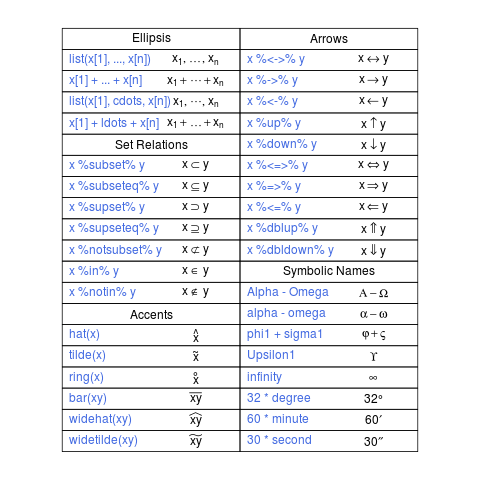
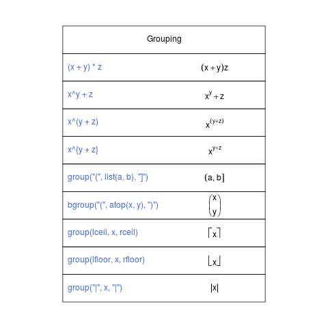
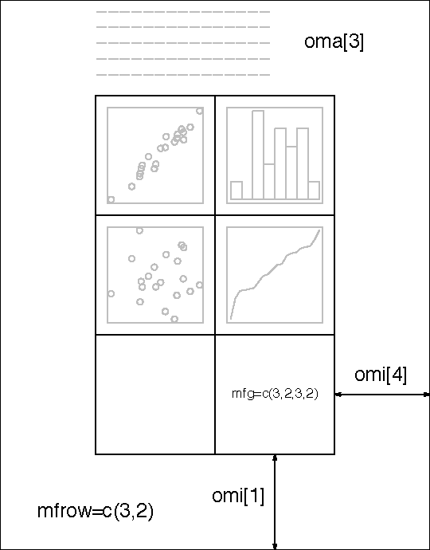

## The R Graphics Package
# Package: graphics

- basic function for graphics
- Function List
```{r}
library(help="graphics")
```

- 簡單  
- 可快速觀察資料
- 自由度大，易調整版面

--- 

## R basic graphic tools

1. Simple Plots
2. Add something to a plot
3. Adjust
  - Graphical Elements
  - Figure Margins
  - Multiple Figure Environment
4. Others
5. Projects

--- .segue .nobackground .dark
## Simple Plots


--- &twocol
## Simple Plots

*** =left
```{r,echo=FALSE,fig.cap="",fig.height=7,warning=FALSE}
x=51:60
y=101:110
par(cex=1.5,mar=c(4,4,4,2))
plot(x,y)
title('XY座標',cex.main=2,col.main='gray50')
mtext('plot(x,y)',3,cex=2)
text(52,108,'x=51:60
y=101:110',pos=4)
```

*** =right
```{r,echo=FALSE,fig.cap="",warning=FALSE,fig.height=7}
par(cex=1.5,mar=c(4,4,4,2))
plot(y)
title('只給一個變數',cex.main=2,col.main='gray50')
mtext('plot(y)',3,cex=2)
text(2,108,'y=101:110',pos=4)
```

--- 
## Simple Plots
# Object Class: data.frame or matrix or vector
# Data: iris
```{r, echo=FALSE,results='asis',message=FALSE}
library(xtable)
library(xts)
x=xtable(iris)
print(x,type='html')
```

--- &twocol
## Simple Plots

*** =left

```{r,echo=FALSE,fig.cap="",warning=FALSE,fig.height=7}
par(cex=1.5,mar=c(4,4,4,2))
plot(iris[,3:4],main='指定欄位',col.main='gray50',cex.main=2)
mtext('plot(iris[,3:4])',3,cex=1.8)
text(1,2,'只能以
column方向代入',cex=1.5,pos=4)
```

*** =right
```{r,echo=FALSE,warning=FALSE,fig.height=7}
par(cex=1.5,mar=c(4,4,4,2))
plot(Petal.Width~Petal.Length,data=iris)
title('Formula',col.main='gray50',cex.main=2)
mtext('plot(Petal.Width~Petal.Length,data=iris)',3,cex=1.8)
text(1,2,'plot(y ~ x,data)',cex=1.5,pos=4)
```
---
## Simple Plots


1. 趨勢
  - Line Chart
  - Bar Plot

2. 比較、組成
  - Bar Plot
  - Pie Chart

3. 分佈
  - Scatter Plot
  - Histgram
  - Box Plot


---
## Simple Plots-Line Chart

    plot(sin(seq(0,2*pi,1/50)),type='l')
```{r,echo=FALSE,fig.width=13.5}
par(cex=1.5,lwd=3)
plot(sin(seq(0,2*pi,1/50)),type='l')
```

---
## Exercise
<iframe src='http://news.ltn.com.tw/news/focus/paper/758561'></iframe>

---
## Exercise
# 實質薪資倒退十五年？
- 畫出民國69年到102年實質薪資趨勢
- 實質薪資=每人每月平均薪資/消費者物價指數x100
- 每人每月平均薪資：<a href='http://win.dgbas.gov.tw/dgbas04/bc5/EarningAndProductivity/Default.aspx'>薪資及生產力統計資料查詢系統</a>
- 消費者物價指數：<a href='http://www.dgbas.gov.tw/ct.asp?xItem=35375&CtNode=2850&mp=1'>主計總處統計專區</a>

-
    load('salary.RData')
  -   salary_cpi
  -   salary_2013
  -   salary_detail

---
## Exercise
- Data: salary_cpi

```{r,echo=FALSE,results='asis',warning=FALSE}
load('salary.RData')
print(xtable(salary_cpi),type='html')
```

---
## Exercise
# 平均月薪
    plot(salary_cpi[,1:2],type='l')
```{r, fig.cap='',fig.width=13.5,echo=FALSE,fig.height=6.5}
par(cex=1.5,lwd=3)
plot(salary_cpi[,1:2],type='l')
```
---
## Exercise
# 實質薪資
    salary_cpi$real_wage=salary_cpi$salary/salary_cpi$cpi*100
    plot(real_wage~year,salary_cpi,type='l')
```{r, fig.cap='',fig.width=13.5,echo=FALSE,fig.height=6.5}
par(cex=1.5,lwd=3)
salary_cpi$real_wage=salary_cpi$salary/salary_cpi$cpi*100
plot(real_wage~year,salary_cpi,type='l')
```    
---
## Exercise
```{r, fig.cap='',fig.width=13.5,echo=FALSE,warning=FALSE}
load('salary_cpi.RData')
salary_cpi$real_wage=salary_cpi$salary/salary_cpi$cpi*100
par(cex=1.5,lwd=3)
plot(real_wage~year,salary_cpi,type='l')
abline(h=salary_cpi$real_wage[20],lty=2,col=2)
points(salary_cpi[c(20,34),c(1,4)],pch=20,cex=2,col=4)
text(88,40000,paste('88年:',round(salary_cpi[20,4])),pos=2)
text(102,40000,paste('102年:',round(salary_cpi[34,4])),pos=2)
```   

---
## Simple Plots-Bar plot


# 觀察趨勢
# 比較不同類別的差異
# 適用於數量較小的資料

    x=sample(1:150,50) #從1~150中隨機挑選50個數字
    plot(iris[x,5])
```{r ,fig.align='center', fig.height=6,fig.cap="",message=FALSE,warning=FALSE,echo=FALSE}
x=sample(1:150,50) 
plot(iris[x,5],cex.name=2,cex.axis=2)
```


--- &twocol

*** =left

## Simple Plots-Bar plot

    y=table(iris[x,5])
    barplot(y,horiz=TRUE,las=1)
```{r fig.width=7, fig.height=5,fig.cap="",message=FALSE,warning=FALSE,echo=FALSE}
par(mar=c(5,6.5,4,2))
y=table(iris[x,5])
y
barplot(y,horiz=TRUE,cex.name=1.5,cex.axis=1.5,las=1)
```


*** =right
# 只接受vector or matrix
    barplot(y)
```{r fig.width=7, fig.height=7,fig.cap="",message=FALSE,warning=FALSE,echo=FALSE}
barplot(y,cex.name=2,cex.axis=2)
```


---

## Simple Plots-Bar plot
Data: VADeaths
```{r fig.width=7, fig.height=7,fig.cap="",message=FALSE,warning=FALSE,results='asis',echo=FALSE}
print(xtable(VADeaths),type='html')
```


--- &twocol

## Simple Plots-Bar plot

*** =left

    barplot(VADeaths, beside = TRUE,
         legend=rownames(VADeaths))

```{r fig.width=7, fig.height=6.5,fig.cap="",message=FALSE,warning=FALSE,echo=FALSE}

barplot(VADeaths, beside = TRUE,
         legend=rownames(VADeaths))
```

*** =right

    barplot(VADeaths, 
         legend=rownames(VADeaths))    

```{r fig.width=7, fig.height=6.5,fig.cap="",message=FALSE,warning=FALSE,echo=FALSE}

barplot(VADeaths, 
         legend=rownames(VADeaths))
```


--- &twocol

## Simple Plots-Pie
*** =left

- 比較同類別個群體之間的差異
- 常見於新聞媒體
- 只接受正數

```{r fig.width=6.5, fig.height=7,fig.cap="",message=FALSE,warning=FALSE,echo=FALSE}
y
```


    
*** =right
    pie(y)
```{r fig.width=6.5, fig.height=7,fig.cap="",message=FALSE,warning=FALSE,echo=FALSE}
par(cex=1.5)
pie(y)
```

---
## Exercise
# 油電業薪資近9萬，是教服業的4倍?
- 畫出薪資最低與最高的三個行業
- Data: salary_2013

-
    library(xts)
    a=order(salary_2013$每人每月薪資)
    salary_news=matrix(salary_2013$每人每月薪資
    [c(head(a,3),last(a,3))],ncol = 6)
    colnames(salary_news)=salary_2013$行業[c(head(a,3),last(a,3))]
    mp=barplot(salary_news,col='dodgerblue4') #x軸座標
    text(mp,10000,salary_news,col='gold') #標註薪資


---
## Exercise
# 最高薪資與最低薪資
</img>


---
    mp=barplot(salary_news,xaxt='n',col='dodgerblue4')
    text(mp,-10000,colnames(salary_news),xpd=TRUE,srt=20,cex=1.5)
</img>

---
## 但是...，有些事情新聞沒說...
- 若把行業別劃分更細，可以發現更高的薪水...
- 以"salary_detail"再畫一次
</img>

---
## Simple Plots-Scatter Plot

    plot(iris[,3:4])
    plot(Petal.Width~Petal.Length,data=iris)
```{r, fig.width=13.5, fig.height=6.5,fig.cap="",message=FALSE,warning=FALSE,echo=FALSE}
plot(iris[,3:4])
```

---
## Simple Plots-Scatter Plot
    plot(iris[,1:3])
    plot(~Sepal.Length+Sepal.Width+Petal.Length,data=iris)
```{r fig.width=14, fig.height=6.5,fig.cap="",message=FALSE,warning=FALSE,echo=FALSE}
plot(iris[,1:3])
```

---
## Simple Plots-Box plot
    plot(factor,number)
    plot(iris[,5],iris[,1])
```{r,fig.align='center', fig.height=7,fig.width=8,fig.cap="",message=FALSE,warning=FALSE,echo=FALSE}
par(cex=1.5,mar=c(5,4,1,2),bty='l')
x=c(7.894502, 6.887248, 6.502902 ,6.198075 ,5.575168, 4.872741)
plot(iris[,5],iris[,1],xlim=c(0,4.5))
text(3.3,x,c('Maximum','3rd qunttile','mean','1st quantile','Minimum','outlier'),col=2,pos=4)

```

--- &twocol

## Simple Plots-Box plot

*** =left
    
    boxplot(iris[,1]~iris[,5])
    boxplot(Sepal.Length~Species,data=iris)
    
```{r , fig.height=7,fig.cap="",message=FALSE,warning=FALSE,echo=FALSE}
par(cex=1.5,mar=c(5,4,1,2))
boxplot(Sepal.Length~Species,data=iris)
```

*** =right
    boxplot(iris[,1:2])
```{r , fig.height=7,fig.cap="",message=FALSE,warning=FALSE,echo=FALSE}
par(cex=1.5,mar=c(5,4,1,2))
boxplot(iris[,1:2])
```

---
## Simple Plots-Histgram

```{r,fig.align='center', fig.width=6.5, fig.height=7,fig.cap="",message=FALSE,warning=FALSE}
hist(iris[,1],breaks=4)
```


--- .segue .nobackground .dark
## Add Something to a Plot


--- &twocol
## Add Something to a Plot
# 低階繪圖
# 加上點、線、面、座標軸、文字說明
# 需要先有圖，才能畫出，無法獨立執行

*** =left

- <font size=5><b>點</b></font>
  - points
  
- <font size=5><b>線</b></font>
  - lines
  - abline
  - arrows
  - segaments
  - grid

*** =right
- <font size=5><b>面</b></font>
  - rect
  - polygon
- <font size=5><b>文字說明</b></font>
  - text
  - mtext
  - title
  - legend
  
- <font size=5><b>座標軸</b></font>

  - axis


---
## Add Lines

```{r ,fig.width=13.5,fig.cap="",message=FALSE,warning=FALSE,echo=FALSE}
plot(iris[,3:4])
x=seq(0,7,0.05)
y=sin(x)+1
par(lwd=3,cex=2)
lines(x,y,col=2)
text(4.5,0.5,'line(x,y)',col=2)
abline(h=0.75,v=2.5,col=4)
text(1.7,1,'abline(h=0.75,v=2.5)',col=4)
abline(a=-0.36,b=0.42,col=3)
text(4,2,'abline(a=-0.36,b=0.42)',col=3)
text(4,2,expression(bolditalic(y)==b*bolditalic(x)+a),col=3,pos=3)
arrows(4.7,1.2,5.6,1.4,col='gray25')
text(4.1,1,'arrows(x0,y0,x1,y1)',col='gray25',pos=4)
points(3,0.3,cex=1.5,pch=11,col='orange')
text(3.3,0.2,'points(3,0.3,pch=11)',pos=1,col='orange')
```

---
## Add Points
```{r, fig.width=13.5, fig.height=7,fig.cap="",message=FALSE,warning=FALSE,echo=FALSE}
plot(c(-1.75,1),c(0,0),type='n',ann=FALSE,frame.plot=TRUE)
y=seq(1,-1,-.5)
x=seq(-1,1,0.5)
for (i in 1:25){
  if (i %% 5>0){
    points(x[(i %/% 5)+1],y[i %% 5],cex=2.5,pch=i,bg=4)
    text(x[(i %/% 5)+1]-0.15,y[i %% 5],cex=2,as.character(i))
  }
  else{
    points(x[(i %/% 5)],y[5],cex=2.5,pch=i,bg=4)
    text(x[(i %/% 5)]-0.15,y[5],cex=2,as.character(i))
  }
}
points(-1.5,1,cex=2.5,pch=0)
text(-1.65,1,cex=2,'0')

```


---
## Exercise
# 凸顯實質薪資成長率的沉淪
    real_wage=matrix(salary_cpi$real_wage,ncol=34)
    colnames(real_wage)=salary_cpi[,1]
    mp=barplot(real_wage,ylim=c(-20000,60000),col='dodgerblue4',ylab='TWD',xlab='year')
```{r,echo=FALSE,fig.cap="",warning=FALSE,fig.width=13.5,fig.height=6.5}
par(cex=1.5,mar=c(6,4,3,2))
real_wage=matrix(salary_cpi$real_wage,ncol=34)
colnames(real_wage)=salary_cpi[,1]
mp=barplot(real_wage,ylim=c(-20000,60000),col='dodgerblue4',ylab='TWD',xlab='year')
```

---
## Exercise
# 凸顯實質薪資成長率的沉淪
    ratio=diff(salary_cpi$real_wage)/salary_cpi$real_wage[1:33] #實質薪資成長率
    lines(mp[2:34],ratio*500000,typ='o',pch=20,lwd=3,col=2) 
    #畫上實質薪資成長率，為配合原圖的scale，乘上500000
    
```{r,echo=FALSE,fig.cap="",warning=FALSE,fig.width=13.5,fig.height=6.5}
par(cex=1.5,mar=c(6,4,3,2))
real_wage=matrix(salary_cpi$real_wage,ncol=34)
colnames(real_wage)=salary_cpi[,1]
mp=barplot(real_wage,ylim=c(-20000,60000),col='dodgerblue4',ylab='TWD',xlab='year')
ratio=diff(salary_cpi$real_wage)/salary_cpi$real_wage[1:33]
lines(mp[2:34],ratio*500000,typ='o',pch=20,lwd=3,col=2)
```

---
## Exercise
# 凸顯實質薪資成長率的沉淪
    
    axis(4,seq(-20000,60000,10000),labels=paste(seq(-4,12,2),'%',sep = ""),col=2)
    # 加上右邊Y軸，須考慮比例
```{r,echo=FALSE,fig.cap="",warning=FALSE,fig.width=13.5,fig.height=6.5}
par(cex=1.5,mar=c(6,4,3,2))
real_wage=matrix(salary_cpi$real_wage,ncol=34)
colnames(real_wage)=salary_cpi[,1]
mp=barplot(real_wage,ylim=c(-20000,60000),col='dodgerblue4',ylab='TWD',xlab='year')
ratio=diff(salary_cpi$real_wage)/salary_cpi$real_wage[1:33]
lines(mp[2:34],ratio*500000,typ='o',pch=20,lwd=3,col=2)
axis(4,seq(-20000,60000,10000),labels=paste(seq(-4,12,2),'%',sep = ""),col=2)
```    

---
## Exercise
# 凸顯實質薪資成長率的沉淪
    legend("bottomleft",c('實質薪資','實質薪資成長率'),bty='n',
       text.col=c('dodgerblue4','red'),
       col=c('dodgerblue4','red'),pch=c(15,20))# 加上圖例說明
```{r,echo=FALSE,fig.cap="",warning=FALSE,fig.width=13.5,fig.height=6.5}
par(cex=1.5,mar=c(6,4,3,2))
real_wage=matrix(salary_cpi$real_wage,ncol=34)
colnames(real_wage)=salary_cpi[,1]
mp=barplot(real_wage,ylim=c(-20000,60000),col='dodgerblue4',ylab='TWD',xlab='year')
ratio=diff(salary_cpi$real_wage)/salary_cpi$real_wage[1:33]
lines(mp[2:34],ratio*500000,typ='o',pch=20,lwd=3,col=2)
axis(4,seq(-20000,60000,10000),labels=paste(seq(-4,12,2),'%',sep = ""),col=2)
legend("bottomleft",c('實質薪資','實質薪資成長率'),bty='n',
       text.col=c('dodgerblue4','red'),
       col=c('dodgerblue4','red'),pch=c(15,20),cex=1.2)
```    
---
## Exercise
# 凸顯實質薪資成長率的沉淪
    mtext(side=3,'成長率',adj=1) # 在plot的周邊加上說明
```{r,echo=FALSE,fig.cap="",warning=FALSE,fig.width=13.5,fig.height=6.5}
par(cex=1.5,mar=c(6,4,3,2))
real_wage=matrix(salary_cpi$real_wage,ncol=34)
colnames(real_wage)=salary_cpi[,1]
mp=barplot(real_wage,ylim=c(-20000,60000),col='dodgerblue4',ylab='TWD',xlab='year')
ratio=diff(salary_cpi$real_wage)/salary_cpi$real_wage[1:33]
lines(mp[2:34],ratio*500000,typ='o',pch=20,lwd=3,col=2)
axis(4,seq(-20000,60000,10000),labels=paste(seq(-4,12,2),'%',sep = ""),col=2)
legend("bottomleft",c('實質薪資','實質薪資成長率'),bty='n',
       text.col=c('dodgerblue4','red'),
       col=c('dodgerblue4','red'),pch=c(15,20),cex=1.2)
mtext(side=3,'成長率',adj=1,cex=1.5)
``` 

---
## Add text with locator
    locator(n=1)
</img>


--- &twocol
## Mathematical Annotation

*** =left

    x=seq(-pi,pi,pi/1000);y=sin(x)/abs(x)
    plot(x,y)
    text(0,0,expression(over(cos(x)%.%
    sin(x),abs(x))))
    
```{r,fig.height=6,fig.cap="",echo=FALSE}
x=seq(-pi,pi,pi/1000)
y=sin(x)/abs(x)
plot(x,y)
text(0,0,expression(over(cos(x)%.%sin(x),abs(x))))

```
*** =right
</img>

--- &twocol

## Mathematical Annotation

*** =left
</img>

*** =right
</img>

--- &twocol

## Mathematical Annotation

*** =left
</img>

*** =right
</img>

---
## Example- Batman Equation
- R Blogger 
<a href='http://www.r-bloggers.com/batman-equationhappy-halloween-plot-the-batman-logo-in/'>http://www.r-bloggers.com/batman-equationhappy-halloween-plot-the-batman-logo-in/</a>
```{r, fig.cap="",fig.width=13.5,echo=FALSE}

f1 <- function(x) {
  y1 <- 3*sqrt(1-(x/7)^2)
  y2 <- -3*sqrt(1-(x/7)^2)
  y <- c(y1,y2)
  d <- data.frame(x=x,y=y)
  d <- d[d$y > -3*sqrt(33)/7,]
  return(d)
}
x1 <- c(seq(3, 7, 0.001), seq(-7, -3, 0.001))
d1 <- f1(x1)
x2 <- seq(-4,4, 0.001)
y2 <- abs(x2/2)-(3*sqrt(33)-7)*x2^2/112-3 + sqrt(1-(abs(abs(x2)-2)-1)^2)
x3 <- c(seq(0.75,1,0.001), seq(-1,-0.75,0.001))
y3 <- 9-8*abs(x3)
x4 <- c( seq(-0.5,-0.75,-0.001),seq(0.75,0.5,-0.001))
y4 <- 3*abs(x4)+0.75
x5 <- seq(-0.5,0.5,0.001)
y5 <- rep(2.25,length(x5))
x6 <- c(seq(-3,-1,0.001), seq(1,3,0.001))
y6 <- 6 * sqrt(10)/7 +
(1.5 - 0.5 * abs(x6)) * sqrt(abs(abs(x6)-1)/(abs(x6)-1)) -
6 * sqrt(10) * sqrt(4-(abs(x6)-1)^2)/14
dd=data.frame(x=c(x2,x3,x4,x5,x6),y=c(y2,y3,y4,y5,y6))
d1=rbind(d1,dd)
plot(d1,asp=1) # asp: x軸與y軸的比例
text(0,0,expression(((over(x,7))^2*sqrt(over(abs(abs(x)-3),abs(x)-3))+(over(y,3))^2*sqrt(over(abs(y^3-over(sqrt(33),7)),y^3-over(sqrt(33),7)))-1)%.%
                      (abs(over(x,2))-over(3*sqrt(33)-7,122)*x^2-3+sqrt(1-(abs(abs(x)-2)-1)^2)-y)%.%
                      (9*sqrt(over(abs((abs(x)-1)*(abs(x)-over(3,4))),(1-abs(x))*(abs(x)-over(3,4))))-8*abs(x)-y)))
text(0,-0.8,expression((3*abs(x)+over(3,4)*sqrt(over(abs((abs(x)-over(3,4))*(abs(x)-over(1,2))),(over(3,4)-abs(x))*(abs(x)-over(1,2))))-y)%.%
                       (over(9,4)*sqrt(over((x-over(1,2))*(x+over(1,2)),(over(1,2)-x)*(over(1,2)+x)))-y)%.%
                       (over(6*sqrt(10),7)+over(3-abs(x),2)*sqrt(over(abs(abs(x)-1),abs(x)-1))-over(6*sqrt(10),14)*sqrt(4-(abs(x)-1)^2)-y)==0))
```

---

```{r, fig.cap="",fig.width=13.5}

f1 <- function(x) {
  y1 <- 3*sqrt(1-(x/7)^2)
  y2 <- -3*sqrt(1-(x/7)^2)
  y <- c(y1,y2)
  d <- data.frame(x=x,y=y)
  d <- d[d$y > -3*sqrt(33)/7,]
  return(d)
}
x1 <- c(seq(3, 7, 0.001), seq(-7, -3, 0.001))
d1 <- f1(x1)
x2 <- seq(-4,4, 0.001)
y2 <- abs(x2/2)-(3*sqrt(33)-7)*x2^2/112-3 + sqrt(1-(abs(abs(x2)-2)-1)^2)
x3 <- c(seq(0.75,1,0.001), seq(-1,-0.75,0.001))
y3 <- 9-8*abs(x3)
x4 <- c( seq(-0.5,-0.75,-0.001),seq(0.75,0.5,-0.001))
y4 <- 3*abs(x4)+0.75
x5 <- seq(-0.5,0.5,0.001)
y5 <- rep(2.25,length(x5))
```

---
```{r,fig.show='hide'}
x6 <- c(seq(-3,-1,0.001), seq(1,3,0.001))
y6 <- 6 * sqrt(10)/7 +
(1.5 - 0.5 * abs(x6)) * sqrt(abs(abs(x6)-1)/(abs(x6)-1)) -
6 * sqrt(10) * sqrt(4-(abs(x6)-1)^2)/14
dd=data.frame(x=c(x2,x3,x4,x5,x6),y=c(y2,y3,y4,y5,y6))
d1=rbind(d1,dd)
plot(d1,asp=1) # asp: x軸與y軸的比例
text(0,0,expression(((over(x,7))^2*sqrt(over(abs(abs(x)-3),abs(x)-3))+(over(y,3))^2*sqrt(over(abs(y^3-over(sqrt(33),7)),y^3-over(sqrt(33),7)))-1)%.%
                      (abs(over(x,2))-over(3*sqrt(33)-7,122)*x^2-3+sqrt(1-(abs(abs(x)-2)-1)^2)-y)%.%
                      (9*sqrt(over(abs((abs(x)-1)*(abs(x)-over(3,4))),(1-abs(x))*(abs(x)-over(3,4))))-8*abs(x)-y))) ## 方程式的上半段
text(0,-0.8,expression((3*abs(x)+over(3,4)*sqrt(over(abs((abs(x)-over(3,4))*(abs(x)-over(1,2))),(over(3,4)-abs(x))*(abs(x)-over(1,2))))-y)%.%
                       (over(9,4)*sqrt(over((x-over(1,2))*(x+over(1,2)),(over(1,2)-x)*(over(1,2)+x)))-y)%.%
                       (over(6*sqrt(10),7)+over(3-abs(x),2)*sqrt(over(abs(abs(x)-1),abs(x)-1))-over(6*sqrt(10),14)*sqrt(4-(abs(x)-1)^2)-y)==0)) ##方程式的下半段
```
--- .segue .nobackground .dark
## Adjust

---
## Adjust

- Permanent Changes 

-
    par(...)
    
- Temporary Changes (with Simple Plots)
- Graphical Elements
- Figure Margins
- Multiple Figure Environment

---
## Graphical Elements
<a href='http://spark.rstudio.com/kmchen/graphics/'>http://spark.rstudio.com/kmchen/graphics/</a>
<iframe src='http://spark.rstudio.com/kmchen/graphics/'></iframe>

---
## Graphical Elements
# Colors
    colors() #內建的顏色
    rainbow() #產生彩虹色
    palette(rainbow(144)) #將彩虹色設定成預設顏色
    colorRampPalette(c('red','green'))(10) #紅綠漸層 

```{r,echo=FALSE,warning=FALSE,message=FALSE,fig.height=6,fig.width=13.5}
palette(rainbow(144))
plot(1:144,rep(0,144),pch=20,col=1:144,cex=20,ann=FALSE)
```

---
## Example- Barnsley Fern Fractal

```{r,echo=FALSE,warning=FALSE,message=FALSE}
iter = 10000
p = runif(iter)
coord = matrix(c(0, 0), ncol = 1)
df = rbind(data.frame(), t(coord))
for (i in 1:iter) {
        if (p[i] <= 0.05) {
                m = matrix(c(0, 0, 0, 0.16), nrow = 2, ncol = 2)
                const = matrix(c(0, 0), ncol = 1)
        } else if (p[i] > 0.05 && p[i] <= 0.86) {
                m = matrix(c(0.85, -0.04, 0.04, 0.85), nrow = 2, ncol = 2)
                const = matrix(c(0, 1.6), ncol = 1)
        } else if (p[i] > 0.86 && p[i] <= 0.93) {
                m = matrix(c(0.2, 0.23, -0.26, 0.22), nrow = 2, ncol = 2)
                const = matrix(c(0, 1.6), ncol = 1)

} else {
                m = matrix(c(-0.15, 0.26, 0.28, 0.24), nrow = 2, ncol = 2)
                const = matrix(c(0, 0.44), ncol = 1)
        }
        coord = m %*% coord + const
        df = rbind(df, t(coord))
}

plot(x = df[, 2], y = df[, 1], cex = 0.1, asp = 1,frame.plot = FALSE,axes=FALSE,ann = FALSE)

```


---
## Example- Barnsley Fern Fractal
# 想要讓葉子顏色漸層
    a=order(df[,2])
    plot(x = df[a, 2], y = df[a, 1], cex = 0.1, asp = 1,
    col=colorRampPalette(c("darkgreen", "lightgreen"))(10000))
```{r, echo=FALSE,warning=FALSE,message=FALSE,fig.cap=""}
a=order(df[,2])
plot(x = df[a, 2], y = df[a, 1], cex = 0.1, asp = 1,col=colorRampPalette(c("darkgreen", "lightgreen"))(10000),frame.plot = FALSE,axes=FALSE,ann = FALSE)

```

---
## Example- 偽ggplot

```{r, warning=FALSE,message=FALSE,echo=FALSE,fig.cap="",fig.width=13.5}
plot(iris[,3:4],bty='n',axes=FALSE)
rect(par('usr')[1],par('usr')[3],par('usr')[2],par('usr')[4],border='grey89',col='grey89')
grid(col='white',lty=1)
axis(1,col='lightgrey')
axis(2,col='lightgrey')
points(iris[,3:4],pch=20)
```

---
## Example- 偽ggplot

```{r, warning=FALSE,message=FALSE,fig.show='hide'}
plot(iris[,3:4],bty='n',axes=FALSE)
## 利用rect將背景顏色換掉
## par('usr')：繪圖範圍的座標
rect(par('usr')[1],par('usr')[3],par('usr')[2],par('usr')[4],border='grey89',col='grey89')
grid(col='white',lty=1) ## 加上grid
axis(1,col='lightgrey') ## 加上X軸
axis(2,col='lightgrey') ## 加上Y軸
points(iris[,3:4],pch=20) ## 最後畫上data
```


---
## Figure Margins
    par(mar = c(3, 1, 1, 1))#the number of lines of margin
    par(mai = c(3, 1, 1, 1))#margin size specified in inches
</img>

---
## Figure Margins
    par(oma = c(3, 1, 1, 1))#the number of lines of margin
    par(omi = c(3, 1, 1, 1))#margin size specified in inches
</img>

---
## Multiple Figure Environment


    par(mfrow=c(3,2))
    
```{r, fig.cap="",echo=FALSE,fig.width=13.5}
par(mfrow=c(3,2))
for (i in 1:6){
  plot(0,0,type='n',ann=FALSE)
  text(0,0,as.character(i),cex=5)
}

```


---
## Multiple Figure Environment
```{r, fig.cap="",fig.height=6}
nf=layout(matrix(c(2,1,0,3), 2, 2), widths=c(3,1), heights=c(1,3))
par(cex=3)
layout.show(nf)
```

---
## Multiple Figure Environment
```{r, fig.cap="",fig.show='hide'}
layout(matrix(c(2,1,0,3), 2, 2), widths=c(3,1), heights=c(1,3))
xhist=hist(iris[,3],plot=FALSE) # get distribution
yhist=hist(iris[,4],plot=FALSE) # get distribution
par(mar=c(5,5,1,1)) #調整邊界
plot(iris[,3:4])
par(mar=c(0,3,1,1)) #調整邊界
barplot(xhist$counts, axes=FALSE,  space=0)
par(mar=c(3,1,1,0)) #調整邊界
barplot(yhist$counts, axes=FALSE,  space=0, horiz=TRUE)
```

--- &twocol
## Multiple Figure Environment
*** =left
<font size=6>調整邊界前</font>
```{r, fig.cap="",echo=FALSE}
layout(matrix(c(2,1,0,3), 2, 2), widths=c(3,1), heights=c(1,3))
xhist=hist(iris[,3],plot=FALSE)
yhist=hist(iris[,4],plot=FALSE)
plot(iris[,3:4])
barplot(xhist$counts, axes=FALSE,  space=0)
barplot(yhist$counts, axes=FALSE,  space=0, horiz=TRUE)
```

*** =right
<font size=6>調整邊界後</font>
```{r, fig.cap="",echo=FALSE}
layout(matrix(c(2,1,0,3), 2, 2), widths=c(3,1), heights=c(1,3))
xhist=hist(iris[,3],plot=FALSE)
yhist=hist(iris[,4],plot=FALSE)
par(mar=c(5,5,1,1))
plot(iris[,3:4])
par(mar=c(0,3,1,1))
barplot(xhist$counts, axes=FALSE,  space=0)
par(mar=c(3,1,1,0))
barplot(yhist$counts, axes=FALSE,  space=0, horiz=TRUE)
```


---
## Exercise
# 極端的工時與薪資
- 找到工時和薪資太誇張的工作
- 將工時和薪資在同一畫面上呈現
- Data: salary_detail

-

    time_salary=cbind(hours=salary_detail$平均.工時,TWD=salary_detail$每人每月薪資)
    rownames(time_salary)=salary_detail$行業

---
## Exercise
</img>

---
## Exercise
    plot(TWD~hours,time_salary)
```{r,echo=FALSE,fig.cap="",fig.width=13.5,warning=FALSE}
time_salary=cbind(hours=salary_detail$平均.工時,TWD=salary_detail$每人每月薪資)
rownames(time_salary)=salary_detail$行業
plot(TWD~hours,time_salary,ylim=c(2e4,1.2e5))
```

--- 
## Exercise
    ind=identify(time_salary,plot=FALSE)

- identify可以偵測圖上選擇的點之index
- 執行上述指令後，在圖上以滑鼠點擊選擇欲觀察的點
- 選完後，在Console按ESC鍵

---
## Exercise
    points(time_salary[ind,],pch=20,col='red')
    text(time_salary[ind,],rownames(time_salary)[ind],col='dodgerblue',font=2)

</img>

---
## Exercise
# 利用layout，將Scatter plot與Bar plot結合
    layout(matrix(c(1,1,2,3), 2, 2), widths=c(3,6), heights=c(2,2))
    plot(TWD~hours,time_salary,xlim=c(100,260),ylim=c(2e4,1.2e5))
    points(time_salary[ind,],pch=20,col='red')
    text(time_salary[ind,],rownames(time_salary)[ind],pos=1:4,col='dodgerblue',font=2)
    mp1=barplot(time_salary[ind,1],ylab='hours')
    text(mp1,50,time_salary[ind,1])
    barplot(time_salary[ind,2],ylab='TWD')
    text(mp1,10000,time_salary[ind,2])


--- .segue .nobackground .dark
## Others

---
## Save image
    png(file='test.png')
    plot(iris[,3:4])
    dev.off()
- png
- pdf
- jpeg
- bmp
- tiff

---
## wordcloud

```{r, fig.cap="",echo=FALSE,warning=FALSE,message=FALSE,fig.width=12.5,fig.height=3.5,fig.align='center'}
library("wordcloud")
wordcloud(words=c(letters,LETTERS,0:9),freq=seq(1,1000,len=62),rot.per=0,fixed.asp = FALSE)
```

    install.packages("wordcloud")
    library("wordcloud")
    wordcloud(words=c(letters,LETTERS,0:9),freq=seq(1,1000,len=62))
    

---
## Project

# Browser market

<iframe src='http://www.netmarketshare.com/browser-market-share.aspx?qprid=1&qpcustomb=0'></iframe>

# 試著把資料呈現成...

---
```{r,fig.cap="",fig.width=13.5,fig.height=8,echo=FALSE,warning=FALSE,message=FALSE}
library(XML)
library(xts)
html='http://www.netmarketshare.com/browser-market-share.aspx?qprid=1&qpcustomb=0'
test_doc=htmlParse(html,encoding="big5",replaceEntities=TRUE)
test = readHTMLTable(test_doc)
browser_table=data.frame(Month=as.POSIXct(c(paste(2013,7:12,1,sep='-'),paste(2014,1:5,1,sep='-')))) #Transform to time series data
for (i in 2:7){
  browser_table=cbind(browser_table,as.numeric(gsub('%','',as.character(test$fwReportTable1[,i])))) #transform to numeric data
}
colnames(browser_table)[2:7]=colnames(test$fwReportTable1)[2:7]
colnames(browser_table)[2]="IE"

plot_color=c("gray22", "deepskyblue4", "firebrick2", "springgreen4", "orange",'gray50')
palette(plot_color) 
layout(matrix(c(3,1,2,1), 2, 2), widths=c(2,2), heights=c(2,2))
par(mar=c(2,4,0,2),cex=2)
plot(browser_table[,1:2],type='o',lwd=2,ylim=c(0,60),pch=20,ylab="%")
mtext('2013-07~2014-05',cex=2.1)
for (i in 3:7){
  lines(browser_table[,c(1,i)],type='o',col=i-1,lwd=2,pch=20)
}
par(mar=c(0,0,0,0.1),cex=2)
pie(as.numeric(last(browser_table)[2:7]),col=1:6,labels="")
legend('topleft',legend=colnames(browser_table)[2:7],text.col=1:6,col=1:6,pch=20,bty='n')
legend('right',bty='n',legend="",title='2014 May')
par(mar=c(0,0,0,0),cex=1)
wordcloud(colnames(browser_table)[2:7],last(browser_table)[,2:7]*10000,scale=c(7,1),ordered.colors = TRUE,colors =1:6)
```

---
## Project
# 你可能需要...
    library(XML)
    library(xts)
    html='http://www.netmarketshare.com/browser-market-share.aspx?qprid=1&qpcustomb=0'
    test_doc=htmlParse(html,encoding="big5",replaceEntities=TRUE)
    test = readHTMLTable(test_doc)
    browser_table=data.frame(Month=as.POSIXct(c(paste(2013,7:12,1,sep='-'),
    paste(2014,1:5,1,sep='-')))) #Transform to time series data
    for (i in 2:7){
      #transform to numeric data
      browser_table=cbind(browser_table,
      as.numeric(gsub('%','',as.character(test$fwReportTable1[,i])))) 
    }
    colnames(browser_table)[2:7]=colnames(test$fwReportTable1)[2:7]
    colnames(browser_table)[2]="IE"

---
## Project
# Answer
    plot_color=c("gray22", "deepskyblue4", "firebrick2", "springgreen4", "orange",'gray50')
    palette(plot_color) 
    layout(matrix(c(3,1,2,1), 2, 2), widths=c(2,2), heights=c(2,2))
    par(mar=c(4,4,0,2),cex=1.2)
    plot(browser_table[,1:2],type='o',lwd=2,ylim=c(0,60),pch=20)
    for (i in 3:7){
      lines(browser_table[,c(1,i)],type='o',col=i-1,lwd=2,pch=20)
    }
    par(mar=c(0,0,0,0.1),cex=1.2)
    pie(as.numeric(last(browser_table)[2:7]),col=1:6,labels="")
    legend('topleft',legend=colnames(browser_table)[2:7],text.col=1:6,col=1:6,pch=20,bty='n')
    par(mar=c(0,0,0,0),cex=1)
    wordcloud(colnames(browser_table)[2:7],last(browser_table)[,2:7]*10000,scale=c(6,1),
    ordered.colors = TRUE,colors =1:6)

--- .segue .nobackground .dark
## Thank you!
