## The R Graphics Package
# Package: graphics

- basic function for graphics
- Function List

```r
library(help = "graphics")
```


- 簡單  
- 可快速觀察資料
- 自由度大，易調整版面

--- 

## R basic graphic tools

1. Simple Plots
2. Add something to a plot
3. Adjust
  - Graphical Elements
  - Figure Margins
  - Multiple Figure Environment
4. Others
5. Projects

--- .segue .nobackground .dark
## Simple Plots


--- &twocol
## Simple Plots

*** =left
 


*** =right
 


--- 
## Simple Plots
# Object Class: data.frame or matrix or vector
# Data: iris
<!-- html table generated in R 2.15.3 by xtable 1.7-1 package -->
<!-- Tue Jul 29 15:57:36 2014 -->
<TABLE border=1>
<TR> <TH>  </TH> <TH> Sepal.Length </TH> <TH> Sepal.Width </TH> <TH> Petal.Length </TH> <TH> Petal.Width </TH> <TH> Species </TH>  </TR>
  <TR> <TD align="right"> 1 </TD> <TD align="right"> 5.10 </TD> <TD align="right"> 3.50 </TD> <TD align="right"> 1.40 </TD> <TD align="right"> 0.20 </TD> <TD> setosa </TD> </TR>
  <TR> <TD align="right"> 2 </TD> <TD align="right"> 4.90 </TD> <TD align="right"> 3.00 </TD> <TD align="right"> 1.40 </TD> <TD align="right"> 0.20 </TD> <TD> setosa </TD> </TR>
  <TR> <TD align="right"> 3 </TD> <TD align="right"> 4.70 </TD> <TD align="right"> 3.20 </TD> <TD align="right"> 1.30 </TD> <TD align="right"> 0.20 </TD> <TD> setosa </TD> </TR>
  <TR> <TD align="right"> 4 </TD> <TD align="right"> 4.60 </TD> <TD align="right"> 3.10 </TD> <TD align="right"> 1.50 </TD> <TD align="right"> 0.20 </TD> <TD> setosa </TD> </TR>
  <TR> <TD align="right"> 5 </TD> <TD align="right"> 5.00 </TD> <TD align="right"> 3.60 </TD> <TD align="right"> 1.40 </TD> <TD align="right"> 0.20 </TD> <TD> setosa </TD> </TR>
  <TR> <TD align="right"> 6 </TD> <TD align="right"> 5.40 </TD> <TD align="right"> 3.90 </TD> <TD align="right"> 1.70 </TD> <TD align="right"> 0.40 </TD> <TD> setosa </TD> </TR>
  <TR> <TD align="right"> 7 </TD> <TD align="right"> 4.60 </TD> <TD align="right"> 3.40 </TD> <TD align="right"> 1.40 </TD> <TD align="right"> 0.30 </TD> <TD> setosa </TD> </TR>
  <TR> <TD align="right"> 8 </TD> <TD align="right"> 5.00 </TD> <TD align="right"> 3.40 </TD> <TD align="right"> 1.50 </TD> <TD align="right"> 0.20 </TD> <TD> setosa </TD> </TR>
  <TR> <TD align="right"> 9 </TD> <TD align="right"> 4.40 </TD> <TD align="right"> 2.90 </TD> <TD align="right"> 1.40 </TD> <TD align="right"> 0.20 </TD> <TD> setosa </TD> </TR>
  <TR> <TD align="right"> 10 </TD> <TD align="right"> 4.90 </TD> <TD align="right"> 3.10 </TD> <TD align="right"> 1.50 </TD> <TD align="right"> 0.10 </TD> <TD> setosa </TD> </TR>
  <TR> <TD align="right"> 11 </TD> <TD align="right"> 5.40 </TD> <TD align="right"> 3.70 </TD> <TD align="right"> 1.50 </TD> <TD align="right"> 0.20 </TD> <TD> setosa </TD> </TR>
  <TR> <TD align="right"> 12 </TD> <TD align="right"> 4.80 </TD> <TD align="right"> 3.40 </TD> <TD align="right"> 1.60 </TD> <TD align="right"> 0.20 </TD> <TD> setosa </TD> </TR>
  <TR> <TD align="right"> 13 </TD> <TD align="right"> 4.80 </TD> <TD align="right"> 3.00 </TD> <TD align="right"> 1.40 </TD> <TD align="right"> 0.10 </TD> <TD> setosa </TD> </TR>
  <TR> <TD align="right"> 14 </TD> <TD align="right"> 4.30 </TD> <TD align="right"> 3.00 </TD> <TD align="right"> 1.10 </TD> <TD align="right"> 0.10 </TD> <TD> setosa </TD> </TR>
  <TR> <TD align="right"> 15 </TD> <TD align="right"> 5.80 </TD> <TD align="right"> 4.00 </TD> <TD align="right"> 1.20 </TD> <TD align="right"> 0.20 </TD> <TD> setosa </TD> </TR>
  <TR> <TD align="right"> 16 </TD> <TD align="right"> 5.70 </TD> <TD align="right"> 4.40 </TD> <TD align="right"> 1.50 </TD> <TD align="right"> 0.40 </TD> <TD> setosa </TD> </TR>
  <TR> <TD align="right"> 17 </TD> <TD align="right"> 5.40 </TD> <TD align="right"> 3.90 </TD> <TD align="right"> 1.30 </TD> <TD align="right"> 0.40 </TD> <TD> setosa </TD> </TR>
  <TR> <TD align="right"> 18 </TD> <TD align="right"> 5.10 </TD> <TD align="right"> 3.50 </TD> <TD align="right"> 1.40 </TD> <TD align="right"> 0.30 </TD> <TD> setosa </TD> </TR>
  <TR> <TD align="right"> 19 </TD> <TD align="right"> 5.70 </TD> <TD align="right"> 3.80 </TD> <TD align="right"> 1.70 </TD> <TD align="right"> 0.30 </TD> <TD> setosa </TD> </TR>
  <TR> <TD align="right"> 20 </TD> <TD align="right"> 5.10 </TD> <TD align="right"> 3.80 </TD> <TD align="right"> 1.50 </TD> <TD align="right"> 0.30 </TD> <TD> setosa </TD> </TR>
  <TR> <TD align="right"> 21 </TD> <TD align="right"> 5.40 </TD> <TD align="right"> 3.40 </TD> <TD align="right"> 1.70 </TD> <TD align="right"> 0.20 </TD> <TD> setosa </TD> </TR>
  <TR> <TD align="right"> 22 </TD> <TD align="right"> 5.10 </TD> <TD align="right"> 3.70 </TD> <TD align="right"> 1.50 </TD> <TD align="right"> 0.40 </TD> <TD> setosa </TD> </TR>
  <TR> <TD align="right"> 23 </TD> <TD align="right"> 4.60 </TD> <TD align="right"> 3.60 </TD> <TD align="right"> 1.00 </TD> <TD align="right"> 0.20 </TD> <TD> setosa </TD> </TR>
  <TR> <TD align="right"> 24 </TD> <TD align="right"> 5.10 </TD> <TD align="right"> 3.30 </TD> <TD align="right"> 1.70 </TD> <TD align="right"> 0.50 </TD> <TD> setosa </TD> </TR>
  <TR> <TD align="right"> 25 </TD> <TD align="right"> 4.80 </TD> <TD align="right"> 3.40 </TD> <TD align="right"> 1.90 </TD> <TD align="right"> 0.20 </TD> <TD> setosa </TD> </TR>
  <TR> <TD align="right"> 26 </TD> <TD align="right"> 5.00 </TD> <TD align="right"> 3.00 </TD> <TD align="right"> 1.60 </TD> <TD align="right"> 0.20 </TD> <TD> setosa </TD> </TR>
  <TR> <TD align="right"> 27 </TD> <TD align="right"> 5.00 </TD> <TD align="right"> 3.40 </TD> <TD align="right"> 1.60 </TD> <TD align="right"> 0.40 </TD> <TD> setosa </TD> </TR>
  <TR> <TD align="right"> 28 </TD> <TD align="right"> 5.20 </TD> <TD align="right"> 3.50 </TD> <TD align="right"> 1.50 </TD> <TD align="right"> 0.20 </TD> <TD> setosa </TD> </TR>
  <TR> <TD align="right"> 29 </TD> <TD align="right"> 5.20 </TD> <TD align="right"> 3.40 </TD> <TD align="right"> 1.40 </TD> <TD align="right"> 0.20 </TD> <TD> setosa </TD> </TR>
  <TR> <TD align="right"> 30 </TD> <TD align="right"> 4.70 </TD> <TD align="right"> 3.20 </TD> <TD align="right"> 1.60 </TD> <TD align="right"> 0.20 </TD> <TD> setosa </TD> </TR>
  <TR> <TD align="right"> 31 </TD> <TD align="right"> 4.80 </TD> <TD align="right"> 3.10 </TD> <TD align="right"> 1.60 </TD> <TD align="right"> 0.20 </TD> <TD> setosa </TD> </TR>
  <TR> <TD align="right"> 32 </TD> <TD align="right"> 5.40 </TD> <TD align="right"> 3.40 </TD> <TD align="right"> 1.50 </TD> <TD align="right"> 0.40 </TD> <TD> setosa </TD> </TR>
  <TR> <TD align="right"> 33 </TD> <TD align="right"> 5.20 </TD> <TD align="right"> 4.10 </TD> <TD align="right"> 1.50 </TD> <TD align="right"> 0.10 </TD> <TD> setosa </TD> </TR>
  <TR> <TD align="right"> 34 </TD> <TD align="right"> 5.50 </TD> <TD align="right"> 4.20 </TD> <TD align="right"> 1.40 </TD> <TD align="right"> 0.20 </TD> <TD> setosa </TD> </TR>
  <TR> <TD align="right"> 35 </TD> <TD align="right"> 4.90 </TD> <TD align="right"> 3.10 </TD> <TD align="right"> 1.50 </TD> <TD align="right"> 0.20 </TD> <TD> setosa </TD> </TR>
  <TR> <TD align="right"> 36 </TD> <TD align="right"> 5.00 </TD> <TD align="right"> 3.20 </TD> <TD align="right"> 1.20 </TD> <TD align="right"> 0.20 </TD> <TD> setosa </TD> </TR>
  <TR> <TD align="right"> 37 </TD> <TD align="right"> 5.50 </TD> <TD align="right"> 3.50 </TD> <TD align="right"> 1.30 </TD> <TD align="right"> 0.20 </TD> <TD> setosa </TD> </TR>
  <TR> <TD align="right"> 38 </TD> <TD align="right"> 4.90 </TD> <TD align="right"> 3.60 </TD> <TD align="right"> 1.40 </TD> <TD align="right"> 0.10 </TD> <TD> setosa </TD> </TR>
  <TR> <TD align="right"> 39 </TD> <TD align="right"> 4.40 </TD> <TD align="right"> 3.00 </TD> <TD align="right"> 1.30 </TD> <TD align="right"> 0.20 </TD> <TD> setosa </TD> </TR>
  <TR> <TD align="right"> 40 </TD> <TD align="right"> 5.10 </TD> <TD align="right"> 3.40 </TD> <TD align="right"> 1.50 </TD> <TD align="right"> 0.20 </TD> <TD> setosa </TD> </TR>
  <TR> <TD align="right"> 41 </TD> <TD align="right"> 5.00 </TD> <TD align="right"> 3.50 </TD> <TD align="right"> 1.30 </TD> <TD align="right"> 0.30 </TD> <TD> setosa </TD> </TR>
  <TR> <TD align="right"> 42 </TD> <TD align="right"> 4.50 </TD> <TD align="right"> 2.30 </TD> <TD align="right"> 1.30 </TD> <TD align="right"> 0.30 </TD> <TD> setosa </TD> </TR>
  <TR> <TD align="right"> 43 </TD> <TD align="right"> 4.40 </TD> <TD align="right"> 3.20 </TD> <TD align="right"> 1.30 </TD> <TD align="right"> 0.20 </TD> <TD> setosa </TD> </TR>
  <TR> <TD align="right"> 44 </TD> <TD align="right"> 5.00 </TD> <TD align="right"> 3.50 </TD> <TD align="right"> 1.60 </TD> <TD align="right"> 0.60 </TD> <TD> setosa </TD> </TR>
  <TR> <TD align="right"> 45 </TD> <TD align="right"> 5.10 </TD> <TD align="right"> 3.80 </TD> <TD align="right"> 1.90 </TD> <TD align="right"> 0.40 </TD> <TD> setosa </TD> </TR>
  <TR> <TD align="right"> 46 </TD> <TD align="right"> 4.80 </TD> <TD align="right"> 3.00 </TD> <TD align="right"> 1.40 </TD> <TD align="right"> 0.30 </TD> <TD> setosa </TD> </TR>
  <TR> <TD align="right"> 47 </TD> <TD align="right"> 5.10 </TD> <TD align="right"> 3.80 </TD> <TD align="right"> 1.60 </TD> <TD align="right"> 0.20 </TD> <TD> setosa </TD> </TR>
  <TR> <TD align="right"> 48 </TD> <TD align="right"> 4.60 </TD> <TD align="right"> 3.20 </TD> <TD align="right"> 1.40 </TD> <TD align="right"> 0.20 </TD> <TD> setosa </TD> </TR>
  <TR> <TD align="right"> 49 </TD> <TD align="right"> 5.30 </TD> <TD align="right"> 3.70 </TD> <TD align="right"> 1.50 </TD> <TD align="right"> 0.20 </TD> <TD> setosa </TD> </TR>
  <TR> <TD align="right"> 50 </TD> <TD align="right"> 5.00 </TD> <TD align="right"> 3.30 </TD> <TD align="right"> 1.40 </TD> <TD align="right"> 0.20 </TD> <TD> setosa </TD> </TR>
  <TR> <TD align="right"> 51 </TD> <TD align="right"> 7.00 </TD> <TD align="right"> 3.20 </TD> <TD align="right"> 4.70 </TD> <TD align="right"> 1.40 </TD> <TD> versicolor </TD> </TR>
  <TR> <TD align="right"> 52 </TD> <TD align="right"> 6.40 </TD> <TD align="right"> 3.20 </TD> <TD align="right"> 4.50 </TD> <TD align="right"> 1.50 </TD> <TD> versicolor </TD> </TR>
  <TR> <TD align="right"> 53 </TD> <TD align="right"> 6.90 </TD> <TD align="right"> 3.10 </TD> <TD align="right"> 4.90 </TD> <TD align="right"> 1.50 </TD> <TD> versicolor </TD> </TR>
  <TR> <TD align="right"> 54 </TD> <TD align="right"> 5.50 </TD> <TD align="right"> 2.30 </TD> <TD align="right"> 4.00 </TD> <TD align="right"> 1.30 </TD> <TD> versicolor </TD> </TR>
  <TR> <TD align="right"> 55 </TD> <TD align="right"> 6.50 </TD> <TD align="right"> 2.80 </TD> <TD align="right"> 4.60 </TD> <TD align="right"> 1.50 </TD> <TD> versicolor </TD> </TR>
  <TR> <TD align="right"> 56 </TD> <TD align="right"> 5.70 </TD> <TD align="right"> 2.80 </TD> <TD align="right"> 4.50 </TD> <TD align="right"> 1.30 </TD> <TD> versicolor </TD> </TR>
  <TR> <TD align="right"> 57 </TD> <TD align="right"> 6.30 </TD> <TD align="right"> 3.30 </TD> <TD align="right"> 4.70 </TD> <TD align="right"> 1.60 </TD> <TD> versicolor </TD> </TR>
  <TR> <TD align="right"> 58 </TD> <TD align="right"> 4.90 </TD> <TD align="right"> 2.40 </TD> <TD align="right"> 3.30 </TD> <TD align="right"> 1.00 </TD> <TD> versicolor </TD> </TR>
  <TR> <TD align="right"> 59 </TD> <TD align="right"> 6.60 </TD> <TD align="right"> 2.90 </TD> <TD align="right"> 4.60 </TD> <TD align="right"> 1.30 </TD> <TD> versicolor </TD> </TR>
  <TR> <TD align="right"> 60 </TD> <TD align="right"> 5.20 </TD> <TD align="right"> 2.70 </TD> <TD align="right"> 3.90 </TD> <TD align="right"> 1.40 </TD> <TD> versicolor </TD> </TR>
  <TR> <TD align="right"> 61 </TD> <TD align="right"> 5.00 </TD> <TD align="right"> 2.00 </TD> <TD align="right"> 3.50 </TD> <TD align="right"> 1.00 </TD> <TD> versicolor </TD> </TR>
  <TR> <TD align="right"> 62 </TD> <TD align="right"> 5.90 </TD> <TD align="right"> 3.00 </TD> <TD align="right"> 4.20 </TD> <TD align="right"> 1.50 </TD> <TD> versicolor </TD> </TR>
  <TR> <TD align="right"> 63 </TD> <TD align="right"> 6.00 </TD> <TD align="right"> 2.20 </TD> <TD align="right"> 4.00 </TD> <TD align="right"> 1.00 </TD> <TD> versicolor </TD> </TR>
  <TR> <TD align="right"> 64 </TD> <TD align="right"> 6.10 </TD> <TD align="right"> 2.90 </TD> <TD align="right"> 4.70 </TD> <TD align="right"> 1.40 </TD> <TD> versicolor </TD> </TR>
  <TR> <TD align="right"> 65 </TD> <TD align="right"> 5.60 </TD> <TD align="right"> 2.90 </TD> <TD align="right"> 3.60 </TD> <TD align="right"> 1.30 </TD> <TD> versicolor </TD> </TR>
  <TR> <TD align="right"> 66 </TD> <TD align="right"> 6.70 </TD> <TD align="right"> 3.10 </TD> <TD align="right"> 4.40 </TD> <TD align="right"> 1.40 </TD> <TD> versicolor </TD> </TR>
  <TR> <TD align="right"> 67 </TD> <TD align="right"> 5.60 </TD> <TD align="right"> 3.00 </TD> <TD align="right"> 4.50 </TD> <TD align="right"> 1.50 </TD> <TD> versicolor </TD> </TR>
  <TR> <TD align="right"> 68 </TD> <TD align="right"> 5.80 </TD> <TD align="right"> 2.70 </TD> <TD align="right"> 4.10 </TD> <TD align="right"> 1.00 </TD> <TD> versicolor </TD> </TR>
  <TR> <TD align="right"> 69 </TD> <TD align="right"> 6.20 </TD> <TD align="right"> 2.20 </TD> <TD align="right"> 4.50 </TD> <TD align="right"> 1.50 </TD> <TD> versicolor </TD> </TR>
  <TR> <TD align="right"> 70 </TD> <TD align="right"> 5.60 </TD> <TD align="right"> 2.50 </TD> <TD align="right"> 3.90 </TD> <TD align="right"> 1.10 </TD> <TD> versicolor </TD> </TR>
  <TR> <TD align="right"> 71 </TD> <TD align="right"> 5.90 </TD> <TD align="right"> 3.20 </TD> <TD align="right"> 4.80 </TD> <TD align="right"> 1.80 </TD> <TD> versicolor </TD> </TR>
  <TR> <TD align="right"> 72 </TD> <TD align="right"> 6.10 </TD> <TD align="right"> 2.80 </TD> <TD align="right"> 4.00 </TD> <TD align="right"> 1.30 </TD> <TD> versicolor </TD> </TR>
  <TR> <TD align="right"> 73 </TD> <TD align="right"> 6.30 </TD> <TD align="right"> 2.50 </TD> <TD align="right"> 4.90 </TD> <TD align="right"> 1.50 </TD> <TD> versicolor </TD> </TR>
  <TR> <TD align="right"> 74 </TD> <TD align="right"> 6.10 </TD> <TD align="right"> 2.80 </TD> <TD align="right"> 4.70 </TD> <TD align="right"> 1.20 </TD> <TD> versicolor </TD> </TR>
  <TR> <TD align="right"> 75 </TD> <TD align="right"> 6.40 </TD> <TD align="right"> 2.90 </TD> <TD align="right"> 4.30 </TD> <TD align="right"> 1.30 </TD> <TD> versicolor </TD> </TR>
  <TR> <TD align="right"> 76 </TD> <TD align="right"> 6.60 </TD> <TD align="right"> 3.00 </TD> <TD align="right"> 4.40 </TD> <TD align="right"> 1.40 </TD> <TD> versicolor </TD> </TR>
  <TR> <TD align="right"> 77 </TD> <TD align="right"> 6.80 </TD> <TD align="right"> 2.80 </TD> <TD align="right"> 4.80 </TD> <TD align="right"> 1.40 </TD> <TD> versicolor </TD> </TR>
  <TR> <TD align="right"> 78 </TD> <TD align="right"> 6.70 </TD> <TD align="right"> 3.00 </TD> <TD align="right"> 5.00 </TD> <TD align="right"> 1.70 </TD> <TD> versicolor </TD> </TR>
  <TR> <TD align="right"> 79 </TD> <TD align="right"> 6.00 </TD> <TD align="right"> 2.90 </TD> <TD align="right"> 4.50 </TD> <TD align="right"> 1.50 </TD> <TD> versicolor </TD> </TR>
  <TR> <TD align="right"> 80 </TD> <TD align="right"> 5.70 </TD> <TD align="right"> 2.60 </TD> <TD align="right"> 3.50 </TD> <TD align="right"> 1.00 </TD> <TD> versicolor </TD> </TR>
  <TR> <TD align="right"> 81 </TD> <TD align="right"> 5.50 </TD> <TD align="right"> 2.40 </TD> <TD align="right"> 3.80 </TD> <TD align="right"> 1.10 </TD> <TD> versicolor </TD> </TR>
  <TR> <TD align="right"> 82 </TD> <TD align="right"> 5.50 </TD> <TD align="right"> 2.40 </TD> <TD align="right"> 3.70 </TD> <TD align="right"> 1.00 </TD> <TD> versicolor </TD> </TR>
  <TR> <TD align="right"> 83 </TD> <TD align="right"> 5.80 </TD> <TD align="right"> 2.70 </TD> <TD align="right"> 3.90 </TD> <TD align="right"> 1.20 </TD> <TD> versicolor </TD> </TR>
  <TR> <TD align="right"> 84 </TD> <TD align="right"> 6.00 </TD> <TD align="right"> 2.70 </TD> <TD align="right"> 5.10 </TD> <TD align="right"> 1.60 </TD> <TD> versicolor </TD> </TR>
  <TR> <TD align="right"> 85 </TD> <TD align="right"> 5.40 </TD> <TD align="right"> 3.00 </TD> <TD align="right"> 4.50 </TD> <TD align="right"> 1.50 </TD> <TD> versicolor </TD> </TR>
  <TR> <TD align="right"> 86 </TD> <TD align="right"> 6.00 </TD> <TD align="right"> 3.40 </TD> <TD align="right"> 4.50 </TD> <TD align="right"> 1.60 </TD> <TD> versicolor </TD> </TR>
  <TR> <TD align="right"> 87 </TD> <TD align="right"> 6.70 </TD> <TD align="right"> 3.10 </TD> <TD align="right"> 4.70 </TD> <TD align="right"> 1.50 </TD> <TD> versicolor </TD> </TR>
  <TR> <TD align="right"> 88 </TD> <TD align="right"> 6.30 </TD> <TD align="right"> 2.30 </TD> <TD align="right"> 4.40 </TD> <TD align="right"> 1.30 </TD> <TD> versicolor </TD> </TR>
  <TR> <TD align="right"> 89 </TD> <TD align="right"> 5.60 </TD> <TD align="right"> 3.00 </TD> <TD align="right"> 4.10 </TD> <TD align="right"> 1.30 </TD> <TD> versicolor </TD> </TR>
  <TR> <TD align="right"> 90 </TD> <TD align="right"> 5.50 </TD> <TD align="right"> 2.50 </TD> <TD align="right"> 4.00 </TD> <TD align="right"> 1.30 </TD> <TD> versicolor </TD> </TR>
  <TR> <TD align="right"> 91 </TD> <TD align="right"> 5.50 </TD> <TD align="right"> 2.60 </TD> <TD align="right"> 4.40 </TD> <TD align="right"> 1.20 </TD> <TD> versicolor </TD> </TR>
  <TR> <TD align="right"> 92 </TD> <TD align="right"> 6.10 </TD> <TD align="right"> 3.00 </TD> <TD align="right"> 4.60 </TD> <TD align="right"> 1.40 </TD> <TD> versicolor </TD> </TR>
  <TR> <TD align="right"> 93 </TD> <TD align="right"> 5.80 </TD> <TD align="right"> 2.60 </TD> <TD align="right"> 4.00 </TD> <TD align="right"> 1.20 </TD> <TD> versicolor </TD> </TR>
  <TR> <TD align="right"> 94 </TD> <TD align="right"> 5.00 </TD> <TD align="right"> 2.30 </TD> <TD align="right"> 3.30 </TD> <TD align="right"> 1.00 </TD> <TD> versicolor </TD> </TR>
  <TR> <TD align="right"> 95 </TD> <TD align="right"> 5.60 </TD> <TD align="right"> 2.70 </TD> <TD align="right"> 4.20 </TD> <TD align="right"> 1.30 </TD> <TD> versicolor </TD> </TR>
  <TR> <TD align="right"> 96 </TD> <TD align="right"> 5.70 </TD> <TD align="right"> 3.00 </TD> <TD align="right"> 4.20 </TD> <TD align="right"> 1.20 </TD> <TD> versicolor </TD> </TR>
  <TR> <TD align="right"> 97 </TD> <TD align="right"> 5.70 </TD> <TD align="right"> 2.90 </TD> <TD align="right"> 4.20 </TD> <TD align="right"> 1.30 </TD> <TD> versicolor </TD> </TR>
  <TR> <TD align="right"> 98 </TD> <TD align="right"> 6.20 </TD> <TD align="right"> 2.90 </TD> <TD align="right"> 4.30 </TD> <TD align="right"> 1.30 </TD> <TD> versicolor </TD> </TR>
  <TR> <TD align="right"> 99 </TD> <TD align="right"> 5.10 </TD> <TD align="right"> 2.50 </TD> <TD align="right"> 3.00 </TD> <TD align="right"> 1.10 </TD> <TD> versicolor </TD> </TR>
  <TR> <TD align="right"> 100 </TD> <TD align="right"> 5.70 </TD> <TD align="right"> 2.80 </TD> <TD align="right"> 4.10 </TD> <TD align="right"> 1.30 </TD> <TD> versicolor </TD> </TR>
  <TR> <TD align="right"> 101 </TD> <TD align="right"> 6.30 </TD> <TD align="right"> 3.30 </TD> <TD align="right"> 6.00 </TD> <TD align="right"> 2.50 </TD> <TD> virginica </TD> </TR>
  <TR> <TD align="right"> 102 </TD> <TD align="right"> 5.80 </TD> <TD align="right"> 2.70 </TD> <TD align="right"> 5.10 </TD> <TD align="right"> 1.90 </TD> <TD> virginica </TD> </TR>
  <TR> <TD align="right"> 103 </TD> <TD align="right"> 7.10 </TD> <TD align="right"> 3.00 </TD> <TD align="right"> 5.90 </TD> <TD align="right"> 2.10 </TD> <TD> virginica </TD> </TR>
  <TR> <TD align="right"> 104 </TD> <TD align="right"> 6.30 </TD> <TD align="right"> 2.90 </TD> <TD align="right"> 5.60 </TD> <TD align="right"> 1.80 </TD> <TD> virginica </TD> </TR>
  <TR> <TD align="right"> 105 </TD> <TD align="right"> 6.50 </TD> <TD align="right"> 3.00 </TD> <TD align="right"> 5.80 </TD> <TD align="right"> 2.20 </TD> <TD> virginica </TD> </TR>
  <TR> <TD align="right"> 106 </TD> <TD align="right"> 7.60 </TD> <TD align="right"> 3.00 </TD> <TD align="right"> 6.60 </TD> <TD align="right"> 2.10 </TD> <TD> virginica </TD> </TR>
  <TR> <TD align="right"> 107 </TD> <TD align="right"> 4.90 </TD> <TD align="right"> 2.50 </TD> <TD align="right"> 4.50 </TD> <TD align="right"> 1.70 </TD> <TD> virginica </TD> </TR>
  <TR> <TD align="right"> 108 </TD> <TD align="right"> 7.30 </TD> <TD align="right"> 2.90 </TD> <TD align="right"> 6.30 </TD> <TD align="right"> 1.80 </TD> <TD> virginica </TD> </TR>
  <TR> <TD align="right"> 109 </TD> <TD align="right"> 6.70 </TD> <TD align="right"> 2.50 </TD> <TD align="right"> 5.80 </TD> <TD align="right"> 1.80 </TD> <TD> virginica </TD> </TR>
  <TR> <TD align="right"> 110 </TD> <TD align="right"> 7.20 </TD> <TD align="right"> 3.60 </TD> <TD align="right"> 6.10 </TD> <TD align="right"> 2.50 </TD> <TD> virginica </TD> </TR>
  <TR> <TD align="right"> 111 </TD> <TD align="right"> 6.50 </TD> <TD align="right"> 3.20 </TD> <TD align="right"> 5.10 </TD> <TD align="right"> 2.00 </TD> <TD> virginica </TD> </TR>
  <TR> <TD align="right"> 112 </TD> <TD align="right"> 6.40 </TD> <TD align="right"> 2.70 </TD> <TD align="right"> 5.30 </TD> <TD align="right"> 1.90 </TD> <TD> virginica </TD> </TR>
  <TR> <TD align="right"> 113 </TD> <TD align="right"> 6.80 </TD> <TD align="right"> 3.00 </TD> <TD align="right"> 5.50 </TD> <TD align="right"> 2.10 </TD> <TD> virginica </TD> </TR>
  <TR> <TD align="right"> 114 </TD> <TD align="right"> 5.70 </TD> <TD align="right"> 2.50 </TD> <TD align="right"> 5.00 </TD> <TD align="right"> 2.00 </TD> <TD> virginica </TD> </TR>
  <TR> <TD align="right"> 115 </TD> <TD align="right"> 5.80 </TD> <TD align="right"> 2.80 </TD> <TD align="right"> 5.10 </TD> <TD align="right"> 2.40 </TD> <TD> virginica </TD> </TR>
  <TR> <TD align="right"> 116 </TD> <TD align="right"> 6.40 </TD> <TD align="right"> 3.20 </TD> <TD align="right"> 5.30 </TD> <TD align="right"> 2.30 </TD> <TD> virginica </TD> </TR>
  <TR> <TD align="right"> 117 </TD> <TD align="right"> 6.50 </TD> <TD align="right"> 3.00 </TD> <TD align="right"> 5.50 </TD> <TD align="right"> 1.80 </TD> <TD> virginica </TD> </TR>
  <TR> <TD align="right"> 118 </TD> <TD align="right"> 7.70 </TD> <TD align="right"> 3.80 </TD> <TD align="right"> 6.70 </TD> <TD align="right"> 2.20 </TD> <TD> virginica </TD> </TR>
  <TR> <TD align="right"> 119 </TD> <TD align="right"> 7.70 </TD> <TD align="right"> 2.60 </TD> <TD align="right"> 6.90 </TD> <TD align="right"> 2.30 </TD> <TD> virginica </TD> </TR>
  <TR> <TD align="right"> 120 </TD> <TD align="right"> 6.00 </TD> <TD align="right"> 2.20 </TD> <TD align="right"> 5.00 </TD> <TD align="right"> 1.50 </TD> <TD> virginica </TD> </TR>
  <TR> <TD align="right"> 121 </TD> <TD align="right"> 6.90 </TD> <TD align="right"> 3.20 </TD> <TD align="right"> 5.70 </TD> <TD align="right"> 2.30 </TD> <TD> virginica </TD> </TR>
  <TR> <TD align="right"> 122 </TD> <TD align="right"> 5.60 </TD> <TD align="right"> 2.80 </TD> <TD align="right"> 4.90 </TD> <TD align="right"> 2.00 </TD> <TD> virginica </TD> </TR>
  <TR> <TD align="right"> 123 </TD> <TD align="right"> 7.70 </TD> <TD align="right"> 2.80 </TD> <TD align="right"> 6.70 </TD> <TD align="right"> 2.00 </TD> <TD> virginica </TD> </TR>
  <TR> <TD align="right"> 124 </TD> <TD align="right"> 6.30 </TD> <TD align="right"> 2.70 </TD> <TD align="right"> 4.90 </TD> <TD align="right"> 1.80 </TD> <TD> virginica </TD> </TR>
  <TR> <TD align="right"> 125 </TD> <TD align="right"> 6.70 </TD> <TD align="right"> 3.30 </TD> <TD align="right"> 5.70 </TD> <TD align="right"> 2.10 </TD> <TD> virginica </TD> </TR>
  <TR> <TD align="right"> 126 </TD> <TD align="right"> 7.20 </TD> <TD align="right"> 3.20 </TD> <TD align="right"> 6.00 </TD> <TD align="right"> 1.80 </TD> <TD> virginica </TD> </TR>
  <TR> <TD align="right"> 127 </TD> <TD align="right"> 6.20 </TD> <TD align="right"> 2.80 </TD> <TD align="right"> 4.80 </TD> <TD align="right"> 1.80 </TD> <TD> virginica </TD> </TR>
  <TR> <TD align="right"> 128 </TD> <TD align="right"> 6.10 </TD> <TD align="right"> 3.00 </TD> <TD align="right"> 4.90 </TD> <TD align="right"> 1.80 </TD> <TD> virginica </TD> </TR>
  <TR> <TD align="right"> 129 </TD> <TD align="right"> 6.40 </TD> <TD align="right"> 2.80 </TD> <TD align="right"> 5.60 </TD> <TD align="right"> 2.10 </TD> <TD> virginica </TD> </TR>
  <TR> <TD align="right"> 130 </TD> <TD align="right"> 7.20 </TD> <TD align="right"> 3.00 </TD> <TD align="right"> 5.80 </TD> <TD align="right"> 1.60 </TD> <TD> virginica </TD> </TR>
  <TR> <TD align="right"> 131 </TD> <TD align="right"> 7.40 </TD> <TD align="right"> 2.80 </TD> <TD align="right"> 6.10 </TD> <TD align="right"> 1.90 </TD> <TD> virginica </TD> </TR>
  <TR> <TD align="right"> 132 </TD> <TD align="right"> 7.90 </TD> <TD align="right"> 3.80 </TD> <TD align="right"> 6.40 </TD> <TD align="right"> 2.00 </TD> <TD> virginica </TD> </TR>
  <TR> <TD align="right"> 133 </TD> <TD align="right"> 6.40 </TD> <TD align="right"> 2.80 </TD> <TD align="right"> 5.60 </TD> <TD align="right"> 2.20 </TD> <TD> virginica </TD> </TR>
  <TR> <TD align="right"> 134 </TD> <TD align="right"> 6.30 </TD> <TD align="right"> 2.80 </TD> <TD align="right"> 5.10 </TD> <TD align="right"> 1.50 </TD> <TD> virginica </TD> </TR>
  <TR> <TD align="right"> 135 </TD> <TD align="right"> 6.10 </TD> <TD align="right"> 2.60 </TD> <TD align="right"> 5.60 </TD> <TD align="right"> 1.40 </TD> <TD> virginica </TD> </TR>
  <TR> <TD align="right"> 136 </TD> <TD align="right"> 7.70 </TD> <TD align="right"> 3.00 </TD> <TD align="right"> 6.10 </TD> <TD align="right"> 2.30 </TD> <TD> virginica </TD> </TR>
  <TR> <TD align="right"> 137 </TD> <TD align="right"> 6.30 </TD> <TD align="right"> 3.40 </TD> <TD align="right"> 5.60 </TD> <TD align="right"> 2.40 </TD> <TD> virginica </TD> </TR>
  <TR> <TD align="right"> 138 </TD> <TD align="right"> 6.40 </TD> <TD align="right"> 3.10 </TD> <TD align="right"> 5.50 </TD> <TD align="right"> 1.80 </TD> <TD> virginica </TD> </TR>
  <TR> <TD align="right"> 139 </TD> <TD align="right"> 6.00 </TD> <TD align="right"> 3.00 </TD> <TD align="right"> 4.80 </TD> <TD align="right"> 1.80 </TD> <TD> virginica </TD> </TR>
  <TR> <TD align="right"> 140 </TD> <TD align="right"> 6.90 </TD> <TD align="right"> 3.10 </TD> <TD align="right"> 5.40 </TD> <TD align="right"> 2.10 </TD> <TD> virginica </TD> </TR>
  <TR> <TD align="right"> 141 </TD> <TD align="right"> 6.70 </TD> <TD align="right"> 3.10 </TD> <TD align="right"> 5.60 </TD> <TD align="right"> 2.40 </TD> <TD> virginica </TD> </TR>
  <TR> <TD align="right"> 142 </TD> <TD align="right"> 6.90 </TD> <TD align="right"> 3.10 </TD> <TD align="right"> 5.10 </TD> <TD align="right"> 2.30 </TD> <TD> virginica </TD> </TR>
  <TR> <TD align="right"> 143 </TD> <TD align="right"> 5.80 </TD> <TD align="right"> 2.70 </TD> <TD align="right"> 5.10 </TD> <TD align="right"> 1.90 </TD> <TD> virginica </TD> </TR>
  <TR> <TD align="right"> 144 </TD> <TD align="right"> 6.80 </TD> <TD align="right"> 3.20 </TD> <TD align="right"> 5.90 </TD> <TD align="right"> 2.30 </TD> <TD> virginica </TD> </TR>
  <TR> <TD align="right"> 145 </TD> <TD align="right"> 6.70 </TD> <TD align="right"> 3.30 </TD> <TD align="right"> 5.70 </TD> <TD align="right"> 2.50 </TD> <TD> virginica </TD> </TR>
  <TR> <TD align="right"> 146 </TD> <TD align="right"> 6.70 </TD> <TD align="right"> 3.00 </TD> <TD align="right"> 5.20 </TD> <TD align="right"> 2.30 </TD> <TD> virginica </TD> </TR>
  <TR> <TD align="right"> 147 </TD> <TD align="right"> 6.30 </TD> <TD align="right"> 2.50 </TD> <TD align="right"> 5.00 </TD> <TD align="right"> 1.90 </TD> <TD> virginica </TD> </TR>
  <TR> <TD align="right"> 148 </TD> <TD align="right"> 6.50 </TD> <TD align="right"> 3.00 </TD> <TD align="right"> 5.20 </TD> <TD align="right"> 2.00 </TD> <TD> virginica </TD> </TR>
  <TR> <TD align="right"> 149 </TD> <TD align="right"> 6.20 </TD> <TD align="right"> 3.40 </TD> <TD align="right"> 5.40 </TD> <TD align="right"> 2.30 </TD> <TD> virginica </TD> </TR>
  <TR> <TD align="right"> 150 </TD> <TD align="right"> 5.90 </TD> <TD align="right"> 3.00 </TD> <TD align="right"> 5.10 </TD> <TD align="right"> 1.80 </TD> <TD> virginica </TD> </TR>
   </TABLE>


--- &twocol
## Simple Plots

*** =left

 


*** =right
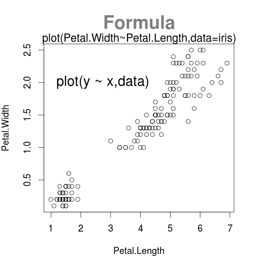 

---
## Simple Plots


1. 趨勢
  - Line Chart
  - Bar Plot

2. 比較、組成
  - Bar Plot
  - Pie Chart

3. 分佈
  - Scatter Plot
  - Histgram
  - Box Plot


---
## Simple Plots-Line Chart

    plot(sin(seq(0,2*pi,1/50)),type='l')
 


---
## Exercise
<iframe src='http://news.ltn.com.tw/news/focus/paper/758561'></iframe>

---
## Exercise
# 實質薪資倒退十五年？
- 畫出民國69年到102年實質薪資趨勢
- 實質薪資=每人每月平均薪資/消費者物價指數x100
- 每人每月平均薪資：<a href='http://win.dgbas.gov.tw/dgbas04/bc5/EarningAndProductivity/Default.aspx'>薪資及生產力統計資料查詢系統</a>
- 消費者物價指數：<a href='http://www.dgbas.gov.tw/ct.asp?xItem=35375&CtNode=2850&mp=1'>主計總處統計專區</a>

-
    load('salary.RData')
  -   salary_cpi
  -   salary_2013
  -   salary_detail

---
## Exercise
- Data: salary_cpi

<!-- html table generated in R 2.15.3 by xtable 1.7-1 package -->
<!-- Tue Jul 29 15:57:37 2014 -->
<TABLE border=1>
<TR> <TH>  </TH> <TH> year </TH> <TH> salary </TH> <TH> cpi$cpi </TH>  </TR>
  <TR> <TD align="right"> 1 </TD> <TD align="right">  69 </TD> <TD align="right"> 8843 </TD> <TD align="right"> 55.61 </TD> </TR>
  <TR> <TD align="right"> 2 </TD> <TD align="right">  70 </TD> <TD align="right"> 10677 </TD> <TD align="right"> 60.67 </TD> </TR>
  <TR> <TD align="right"> 3 </TD> <TD align="right">  71 </TD> <TD align="right"> 11472 </TD> <TD align="right"> 61.83 </TD> </TR>
  <TR> <TD align="right"> 4 </TD> <TD align="right">  72 </TD> <TD align="right"> 12122 </TD> <TD align="right"> 62.17 </TD> </TR>
  <TR> <TD align="right"> 5 </TD> <TD align="right">  73 </TD> <TD align="right"> 13409 </TD> <TD align="right"> 62.64 </TD> </TR>
  <TR> <TD align="right"> 6 </TD> <TD align="right">  74 </TD> <TD align="right"> 13980 </TD> <TD align="right"> 62.16 </TD> </TR>
  <TR> <TD align="right"> 7 </TD> <TD align="right">  75 </TD> <TD align="right"> 15118 </TD> <TD align="right"> 63.41 </TD> </TR>
  <TR> <TD align="right"> 8 </TD> <TD align="right">  76 </TD> <TD align="right"> 16496 </TD> <TD align="right"> 63.69 </TD> </TR>
  <TR> <TD align="right"> 9 </TD> <TD align="right">  77 </TD> <TD align="right"> 18399 </TD> <TD align="right"> 65.12 </TD> </TR>
  <TR> <TD align="right"> 10 </TD> <TD align="right">  78 </TD> <TD align="right"> 21247 </TD> <TD align="right"> 67.56 </TD> </TR>
  <TR> <TD align="right"> 11 </TD> <TD align="right">  79 </TD> <TD align="right"> 24317 </TD> <TD align="right"> 70.21 </TD> </TR>
  <TR> <TD align="right"> 12 </TD> <TD align="right">  80 </TD> <TD align="right"> 26881 </TD> <TD align="right"> 73.59 </TD> </TR>
  <TR> <TD align="right"> 13 </TD> <TD align="right">  81 </TD> <TD align="right"> 29449 </TD> <TD align="right"> 75.87 </TD> </TR>
  <TR> <TD align="right"> 14 </TD> <TD align="right">  82 </TD> <TD align="right"> 31708 </TD> <TD align="right"> 78.21 </TD> </TR>
  <TR> <TD align="right"> 15 </TD> <TD align="right">  83 </TD> <TD align="right"> 33661 </TD> <TD align="right"> 81.25 </TD> </TR>
  <TR> <TD align="right"> 16 </TD> <TD align="right">  84 </TD> <TD align="right"> 35389 </TD> <TD align="right"> 84.69 </TD> </TR>
  <TR> <TD align="right"> 17 </TD> <TD align="right">  85 </TD> <TD align="right"> 36699 </TD> <TD align="right"> 87.40 </TD> </TR>
  <TR> <TD align="right"> 18 </TD> <TD align="right">  86 </TD> <TD align="right"> 38489 </TD> <TD align="right"> 86.94 </TD> </TR>
  <TR> <TD align="right"> 19 </TD> <TD align="right">  87 </TD> <TD align="right"> 39673 </TD> <TD align="right"> 90.34 </TD> </TR>
  <TR> <TD align="right"> 20 </TD> <TD align="right">  88 </TD> <TD align="right"> 40842 </TD> <TD align="right"> 89.53 </TD> </TR>
  <TR> <TD align="right"> 21 </TD> <TD align="right">  89 </TD> <TD align="right"> 41861 </TD> <TD align="right"> 91.55 </TD> </TR>
  <TR> <TD align="right"> 22 </TD> <TD align="right">  90 </TD> <TD align="right"> 41960 </TD> <TD align="right"> 90.51 </TD> </TR>
  <TR> <TD align="right"> 23 </TD> <TD align="right">  91 </TD> <TD align="right"> 41530 </TD> <TD align="right"> 90.00 </TD> </TR>
  <TR> <TD align="right"> 24 </TD> <TD align="right">  92 </TD> <TD align="right"> 42065 </TD> <TD align="right"> 89.58 </TD> </TR>
  <TR> <TD align="right"> 25 </TD> <TD align="right">  93 </TD> <TD align="right"> 42680 </TD> <TD align="right"> 90.95 </TD> </TR>
  <TR> <TD align="right"> 26 </TD> <TD align="right">  94 </TD> <TD align="right"> 43159 </TD> <TD align="right"> 93.23 </TD> </TR>
  <TR> <TD align="right"> 27 </TD> <TD align="right">  95 </TD> <TD align="right"> 43488 </TD> <TD align="right"> 93.45 </TD> </TR>
  <TR> <TD align="right"> 28 </TD> <TD align="right">  96 </TD> <TD align="right"> 44392 </TD> <TD align="right"> 97.94 </TD> </TR>
  <TR> <TD align="right"> 29 </TD> <TD align="right">  97 </TD> <TD align="right"> 44367 </TD> <TD align="right"> 99.83 </TD> </TR>
  <TR> <TD align="right"> 30 </TD> <TD align="right">  98 </TD> <TD align="right"> 42182 </TD> <TD align="right"> 98.22 </TD> </TR>
  <TR> <TD align="right"> 31 </TD> <TD align="right">  99 </TD> <TD align="right"> 44359 </TD> <TD align="right"> 99.71 </TD> </TR>
  <TR> <TD align="right"> 32 </TD> <TD align="right"> 100 </TD> <TD align="right"> 45508 </TD> <TD align="right"> 100.74 </TD> </TR>
  <TR> <TD align="right"> 33 </TD> <TD align="right"> 101 </TD> <TD align="right"> 45589 </TD> <TD align="right"> 102.34 </TD> </TR>
  <TR> <TD align="right"> 34 </TD> <TD align="right"> 102 </TD> <TD align="right"> 45664 </TD> <TD align="right"> 103.04 </TD> </TR>
   </TABLE>


---
## Exercise
# 平均月薪
    plot(salary_cpi[,1:2],type='l')
 

---
## Exercise
# 實質薪資
    salary_cpi$real_wage=salary_cpi$salary/salary_cpi$cpi*100
    plot(real_wage~year,salary_cpi,type='l')
 

---
## Exercise
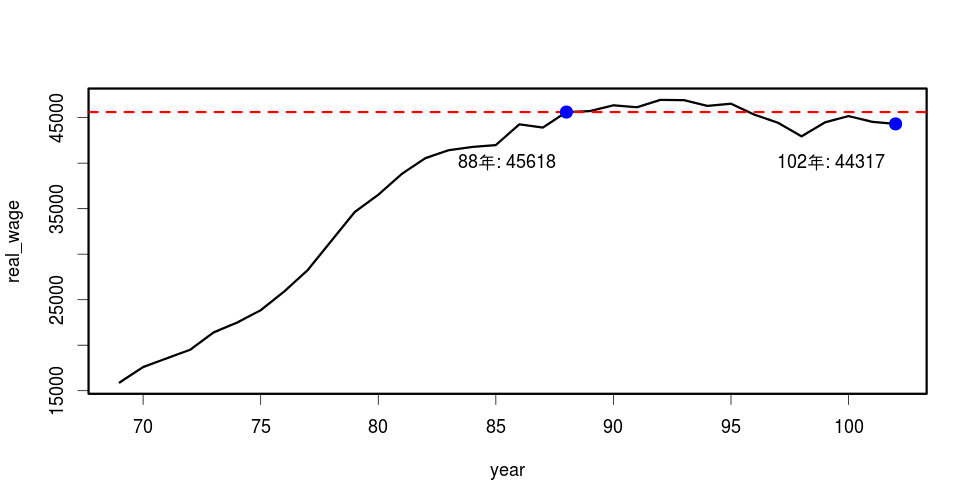 


---
## Simple Plots-Bar plot


# 觀察趨勢
# 比較不同類別的差異
# 適用於數量較小的資料

    x=sample(1:150,50) #從1~150中隨機挑選50個數字
    plot(iris[x,5])
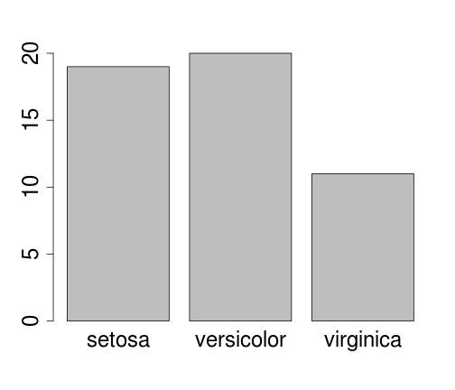


--- &twocol

*** =left

## Simple Plots-Bar plot

    y=table(iris[x,5])
    barplot(y,horiz=TRUE,las=1)

```
## 
##     setosa versicolor  virginica 
##         19         20         11
```

 


*** =right
# 只接受vector or matrix
    barplot(y)
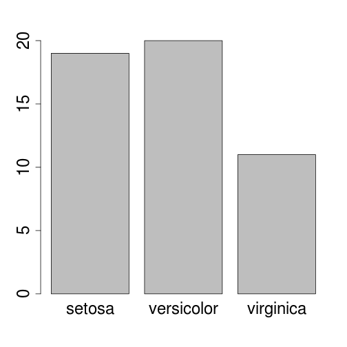 


---

## Simple Plots-Bar plot
Data: VADeaths
<!-- html table generated in R 2.15.3 by xtable 1.7-1 package -->
<!-- Tue Jul 29 15:57:37 2014 -->
<TABLE border=1>
<TR> <TH>  </TH> <TH> Rural Male </TH> <TH> Rural Female </TH> <TH> Urban Male </TH> <TH> Urban Female </TH>  </TR>
  <TR> <TD align="right"> 50-54 </TD> <TD align="right"> 11.70 </TD> <TD align="right"> 8.70 </TD> <TD align="right"> 15.40 </TD> <TD align="right"> 8.40 </TD> </TR>
  <TR> <TD align="right"> 55-59 </TD> <TD align="right"> 18.10 </TD> <TD align="right"> 11.70 </TD> <TD align="right"> 24.30 </TD> <TD align="right"> 13.60 </TD> </TR>
  <TR> <TD align="right"> 60-64 </TD> <TD align="right"> 26.90 </TD> <TD align="right"> 20.30 </TD> <TD align="right"> 37.00 </TD> <TD align="right"> 19.30 </TD> </TR>
  <TR> <TD align="right"> 65-69 </TD> <TD align="right"> 41.00 </TD> <TD align="right"> 30.90 </TD> <TD align="right"> 54.60 </TD> <TD align="right"> 35.10 </TD> </TR>
  <TR> <TD align="right"> 70-74 </TD> <TD align="right"> 66.00 </TD> <TD align="right"> 54.30 </TD> <TD align="right"> 71.10 </TD> <TD align="right"> 50.00 </TD> </TR>
   </TABLE>


--- &twocol

## Simple Plots-Bar plot

*** =left

    barplot(VADeaths, beside = TRUE,
         legend=rownames(VADeaths))

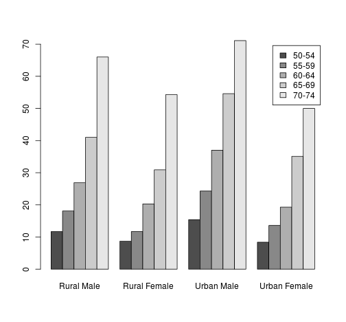 


*** =right

    barplot(VADeaths, 
         legend=rownames(VADeaths))    

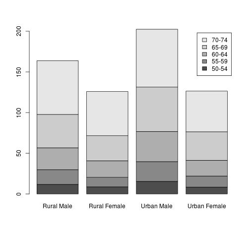 


--- &twocol

## Simple Plots-Pie
*** =left

- 比較同類別個群體之間的差異
- 常見於新聞媒體
- 只接受正數


```
## 
##     setosa versicolor  virginica 
##         19         20         11
```


    
*** =right
    pie(y)
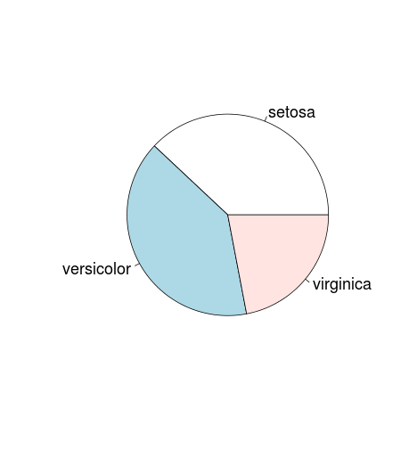 


---
## Exercise
# 油電業薪資近9萬，是教服業的4倍?
- 畫出薪資最低與最高的三個行業
- Data: salary_2013

-
    library(xts)
    a=order(salary_2013$每人每月薪資)
    salary_news=matrix(salary_2013$每人每月薪資
    [c(head(a,3),last(a,3))],ncol = 6)
    colnames(salary_news)=salary_2013$行業[c(head(a,3),last(a,3))]
    mp=barplot(salary_news,col='dodgerblue4') #x軸座標
    text(mp,10000,salary_news,col='gold') #標註薪資


---
## Exercise
# 最高薪資與最低薪資
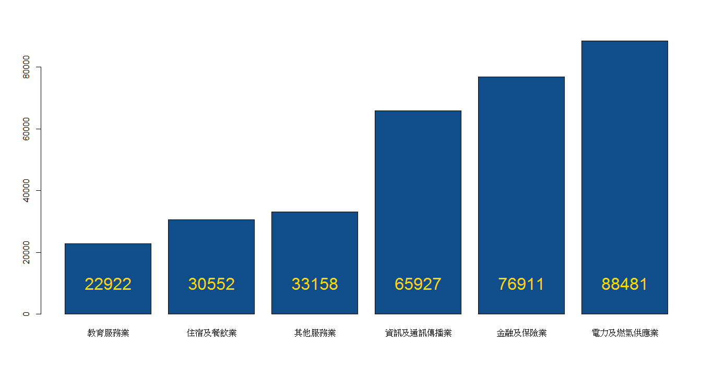</img>


---
    mp=barplot(salary_news,xaxt='n',col='dodgerblue4')
    text(mp,-10000,colnames(salary_news),xpd=TRUE,srt=20,cex=1.5)
</img>

---
## 但是...，有些事情新聞沒說...
- 若把行業別劃分更細，可以發現更高的薪水...
- 以"salary_detail"再畫一次
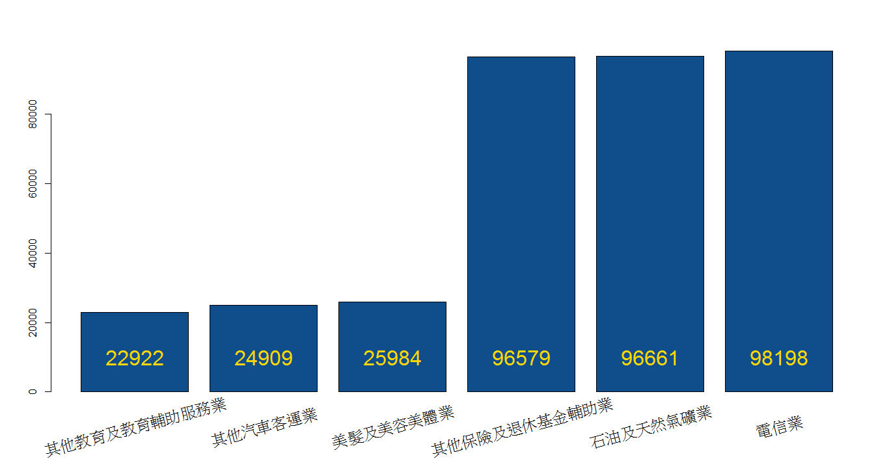</img>

---
## Simple Plots-Scatter Plot

    plot(iris[,3:4])
    plot(Petal.Width~Petal.Length,data=iris)
 


---
## Simple Plots-Scatter Plot
    plot(iris[,1:3])
    plot(~Sepal.Length+Sepal.Width+Petal.Length,data=iris)
 


---
## Simple Plots-Box plot
    plot(factor,number)
    plot(iris[,5],iris[,1])
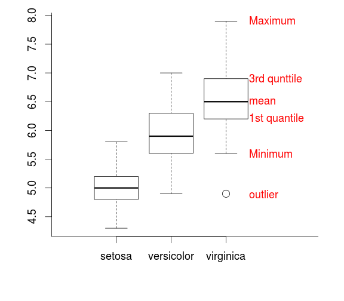


--- &twocol

## Simple Plots-Box plot

*** =left
    
    boxplot(iris[,1]~iris[,5])
    boxplot(Sepal.Length~Species,data=iris)
    
 


*** =right
    boxplot(iris[,1:2])
 


---
## Simple Plots-Histgram


```r
hist(iris[, 1], breaks = 4)
```


--- .segue .nobackground .dark
## Add Something to a Plot


--- &twocol
## Add Something to a Plot
# 低階繪圖
# 加上點、線、面、座標軸、文字說明
# 需要先有圖，才能畫出，無法獨立執行

*** =left

- <font size=5><b>點</b></font>
  - points
  
- <font size=5><b>線</b></font>
  - lines
  - abline
  - arrows
  - segaments
  - grid

*** =right
- <font size=5><b>面</b></font>
  - rect
  - polygon
- <font size=5><b>文字說明</b></font>
  - text
  - mtext
  - title
  - legend
  
- <font size=5><b>座標軸</b></font>

  - axis


---
## Add Lines

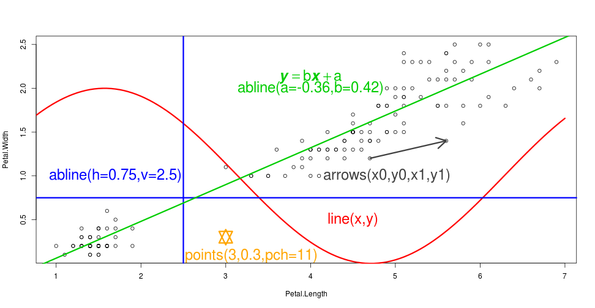 


---
## Add Points
 


---
## Exercise
# 凸顯實質薪資成長率的沉淪
    real_wage=matrix(salary_cpi$real_wage,ncol=34)
    colnames(real_wage)=salary_cpi[,1]
    mp=barplot(real_wage,ylim=c(-20000,60000),col='dodgerblue4',ylab='TWD',xlab='year')
 


---
## Exercise
# 凸顯實質薪資成長率的沉淪
    ratio=diff(salary_cpi$real_wage)/salary_cpi$real_wage[1:33] #實質薪資成長率
    lines(mp[2:34],ratio*500000,typ='o',pch=20,lwd=3,col=2) 
    #畫上實質薪資成長率，為配合原圖的scale，乘上500000
    
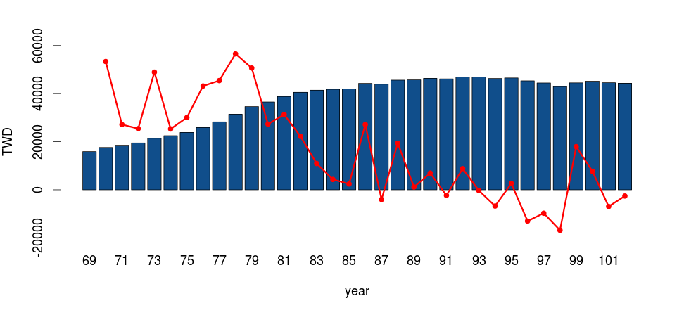 


---
## Exercise
# 凸顯實質薪資成長率的沉淪
    
    axis(4,seq(-20000,60000,10000),labels=paste(seq(-4,12,2),'%',sep = ""),col=2)
    # 加上右邊Y軸，須考慮比例
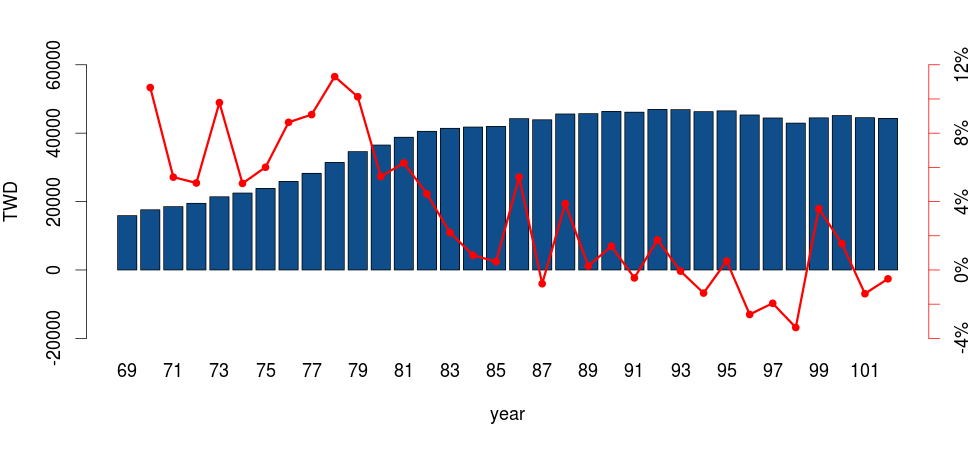 


---
## Exercise
# 凸顯實質薪資成長率的沉淪
    legend("bottomleft",c('實質薪資','實質薪資成長率'),bty='n',
       text.col=c('dodgerblue4','red'),
       col=c('dodgerblue4','red'),pch=c(15,20))# 加上圖例說明
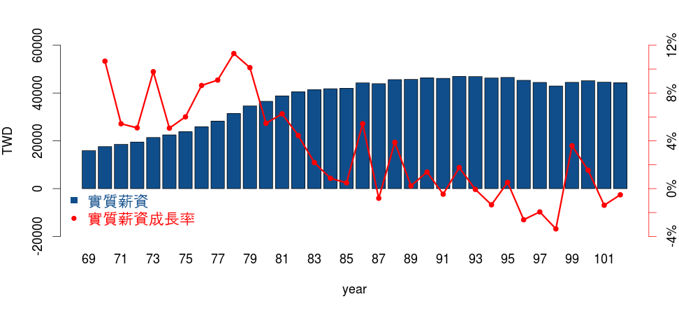 

---
## Exercise
# 凸顯實質薪資成長率的沉淪
    mtext(side=3,'成長率',adj=1) # 在plot的周邊加上說明
 


---
## Add text with locator
    locator(n=1)
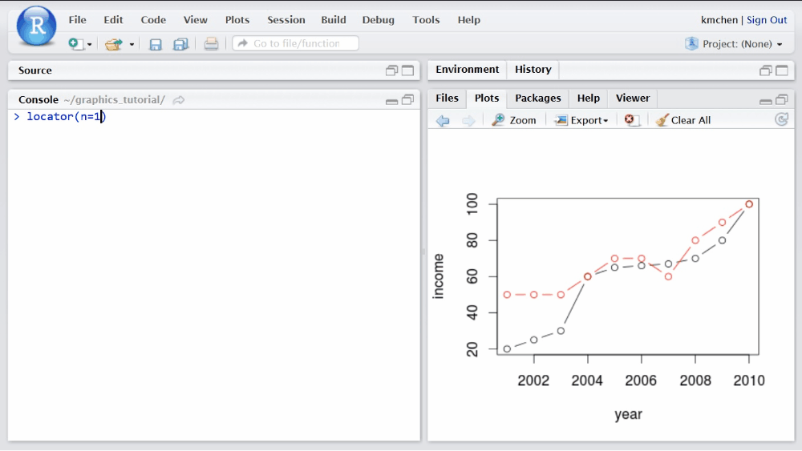</img>


--- &twocol
## Mathematical Annotation

*** =left

    x=seq(-pi,pi,pi/1000);y=sin(x)/abs(x)
    plot(x,y)
    text(0,0,expression(over(cos(x)%.%
    sin(x),abs(x))))
    
 

*** =right
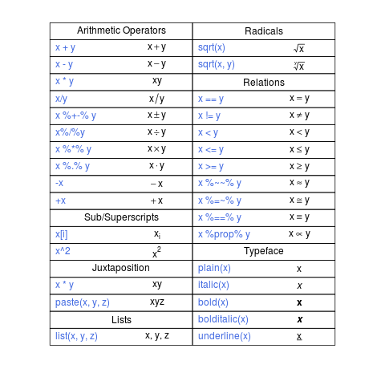</img>

--- &twocol

## Mathematical Annotation

*** =left
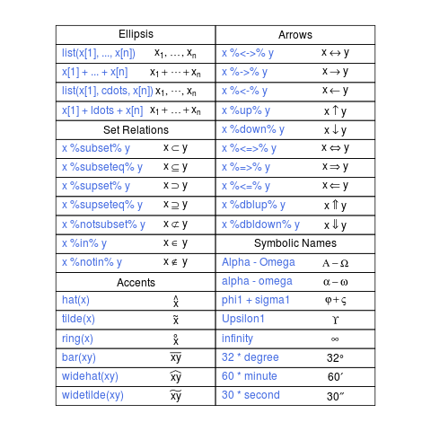</img>

*** =right
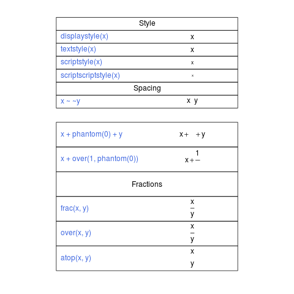</img>

--- &twocol

## Mathematical Annotation

*** =left
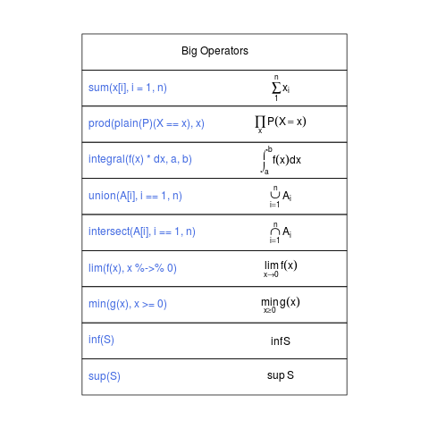</img>

*** =right
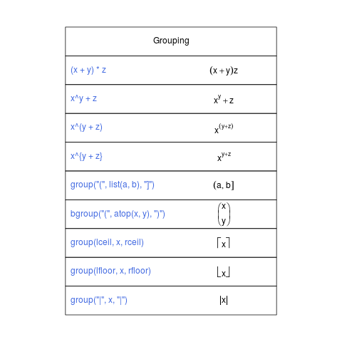</img>

---
## Example- Batman Equation
- R Blogger 
<a href='http://www.r-bloggers.com/batman-equationhappy-halloween-plot-the-batman-logo-in/'>http://www.r-bloggers.com/batman-equationhappy-halloween-plot-the-batman-logo-in/</a>
 


---


```r

f1 <- function(x) {
    y1 <- 3 * sqrt(1 - (x/7)^2)
    y2 <- -3 * sqrt(1 - (x/7)^2)
    y <- c(y1, y2)
    d <- data.frame(x = x, y = y)
    d <- d[d$y > -3 * sqrt(33)/7, ]
    return(d)
}
x1 <- c(seq(3, 7, 0.001), seq(-7, -3, 0.001))
d1 <- f1(x1)
x2 <- seq(-4, 4, 0.001)
y2 <- abs(x2/2) - (3 * sqrt(33) - 7) * x2^2/112 - 3 + sqrt(1 - (abs(abs(x2) - 
    2) - 1)^2)
x3 <- c(seq(0.75, 1, 0.001), seq(-1, -0.75, 0.001))
y3 <- 9 - 8 * abs(x3)
x4 <- c(seq(-0.5, -0.75, -0.001), seq(0.75, 0.5, -0.001))
y4 <- 3 * abs(x4) + 0.75
x5 <- seq(-0.5, 0.5, 0.001)
y5 <- rep(2.25, length(x5))
```


---

```r
x6 <- c(seq(-3, -1, 0.001), seq(1, 3, 0.001))
y6 <- 6 * sqrt(10)/7 + (1.5 - 0.5 * abs(x6)) * sqrt(abs(abs(x6) - 1)/(abs(x6) - 
    1)) - 6 * sqrt(10) * sqrt(4 - (abs(x6) - 1)^2)/14
dd = data.frame(x = c(x2, x3, x4, x5, x6), y = c(y2, y3, y4, y5, y6))
d1 = rbind(d1, dd)
plot(d1, asp = 1)  # asp: x軸與y軸的比例
text(0, 0, expression(((over(x, 7))^2 * sqrt(over(abs(abs(x) - 3), abs(x) - 
    3)) + (over(y, 3))^2 * sqrt(over(abs(y^3 - over(sqrt(33), 7)), y^3 - over(sqrt(33), 
    7))) - 1) %.% (abs(over(x, 2)) - over(3 * sqrt(33) - 7, 122) * x^2 - 3 + 
    sqrt(1 - (abs(abs(x) - 2) - 1)^2) - y) %.% (9 * sqrt(over(abs((abs(x) - 
    1) * (abs(x) - over(3, 4))), (1 - abs(x)) * (abs(x) - over(3, 4)))) - 8 * 
    abs(x) - y)))  ## 方程式的上半段
text(0, -0.8, expression((3 * abs(x) + over(3, 4) * sqrt(over(abs((abs(x) - 
    over(3, 4)) * (abs(x) - over(1, 2))), (over(3, 4) - abs(x)) * (abs(x) - 
    over(1, 2)))) - y) %.% (over(9, 4) * sqrt(over((x - over(1, 2)) * (x + over(1, 
    2)), (over(1, 2) - x) * (over(1, 2) + x))) - y) %.% (over(6 * sqrt(10), 
    7) + over(3 - abs(x), 2) * sqrt(over(abs(abs(x) - 1), abs(x) - 1)) - over(6 * 
    sqrt(10), 14) * sqrt(4 - (abs(x) - 1)^2) - y) == 0))  ##方程式的下半段
```

--- .segue .nobackground .dark
## Adjust

---
## Adjust

- Permanent Changes 

-
    par(...)
    
- Temporary Changes (with Simple Plots)
- Graphical Elements
- Figure Margins
- Multiple Figure Environment

---
## Graphical Elements
<a href='http://spark.rstudio.com/kmchen/graphics/'>http://spark.rstudio.com/kmchen/graphics/</a>
<iframe src='http://spark.rstudio.com/kmchen/graphics/'></iframe>

---
## Graphical Elements
# Colors
    colors() #內建的顏色
    rainbow() #產生彩虹色
    palette(rainbow(144)) #將彩虹色設定成預設顏色
    colorRampPalette(c('red','green'))(10) #紅綠漸層 

 


---
## Example- Barnsley Fern Fractal

 


---
## Example- Barnsley Fern Fractal
# 想要讓葉子顏色漸層
    a=order(df[,2])
    plot(x = df[a, 2], y = df[a, 1], cex = 0.1, asp = 1,
    col=colorRampPalette(c("darkgreen", "lightgreen"))(10000))
 


---
## Example- 偽ggplot

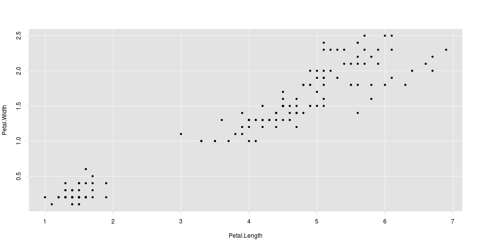 


---
## Example- 偽ggplot


```r
plot(iris[, 3:4], bty = "n", axes = FALSE)
## 利用rect將背景顏色換掉 par('usr')：繪圖範圍的座標
rect(par("usr")[1], par("usr")[3], par("usr")[2], par("usr")[4], border = "grey89", 
    col = "grey89")
grid(col = "white", lty = 1)  ## 加上grid
axis(1, col = "lightgrey")  ## 加上X軸
axis(2, col = "lightgrey")  ## 加上Y軸
points(iris[, 3:4], pch = 20)  ## 最後畫上data
```


---
## Figure Margins
    par(mar = c(3, 1, 1, 1))#the number of lines of margin
    par(mai = c(3, 1, 1, 1))#margin size specified in inches
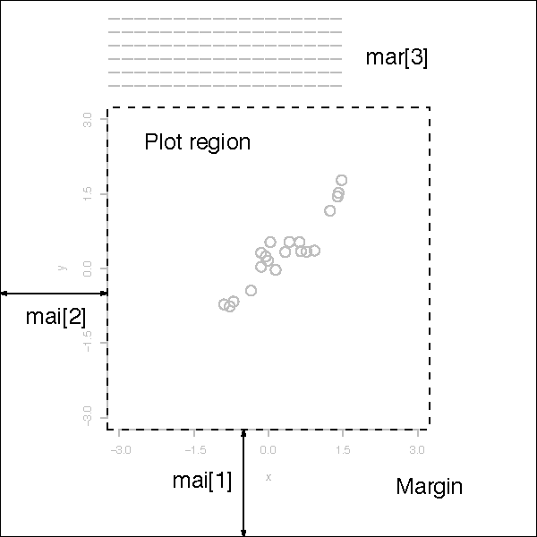</img>

---
## Figure Margins
    par(oma = c(3, 1, 1, 1))#the number of lines of margin
    par(omi = c(3, 1, 1, 1))#margin size specified in inches
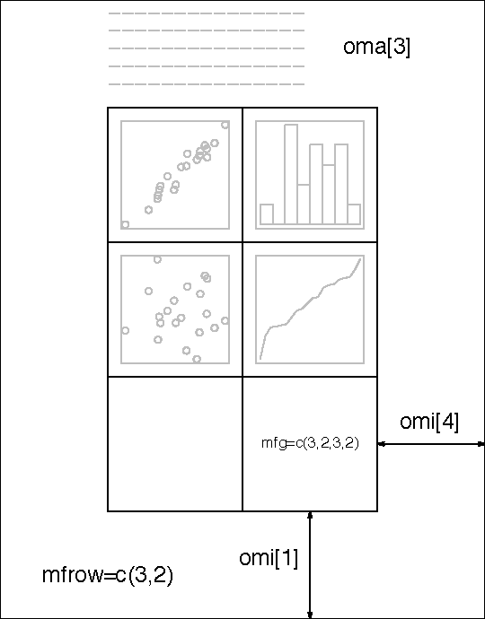</img>

---
## Multiple Figure Environment


    par(mfrow=c(3,2))
    
 


---
## Multiple Figure Environment

```r
nf = layout(matrix(c(2, 1, 0, 3), 2, 2), widths = c(3, 1), heights = c(1, 3))
par(cex = 3)
layout.show(nf)
```

 


---
## Multiple Figure Environment

```r
layout(matrix(c(2, 1, 0, 3), 2, 2), widths = c(3, 1), heights = c(1, 3))
xhist = hist(iris[, 3], plot = FALSE)  # get distribution
yhist = hist(iris[, 4], plot = FALSE)  # get distribution
par(mar = c(5, 5, 1, 1))  #調整邊界
plot(iris[, 3:4])
par(mar = c(0, 3, 1, 1))  #調整邊界
barplot(xhist$counts, axes = FALSE, space = 0)
par(mar = c(3, 1, 1, 0))  #調整邊界
barplot(yhist$counts, axes = FALSE, space = 0, horiz = TRUE)
```


--- &twocol
## Multiple Figure Environment
*** =left
<font size=6>調整邊界前</font>
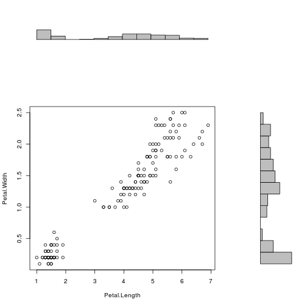 


*** =right
<font size=6>調整邊界後</font>
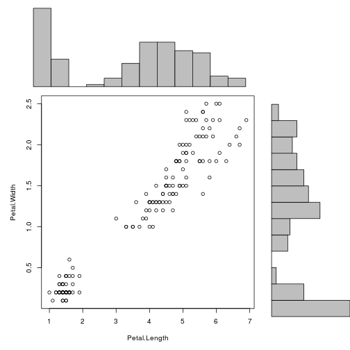 


---
## Exercise
# 極端的工時與薪資
- 找到工時和薪資太誇張的工作
- 將工時和薪資在同一畫面上呈現
- Data: salary_detail

-

    time_salary=cbind(hours=salary_detail$平均.工時,TWD=salary_detail$每人每月薪資)
    rownames(time_salary)=salary_detail$行業

---
## Exercise
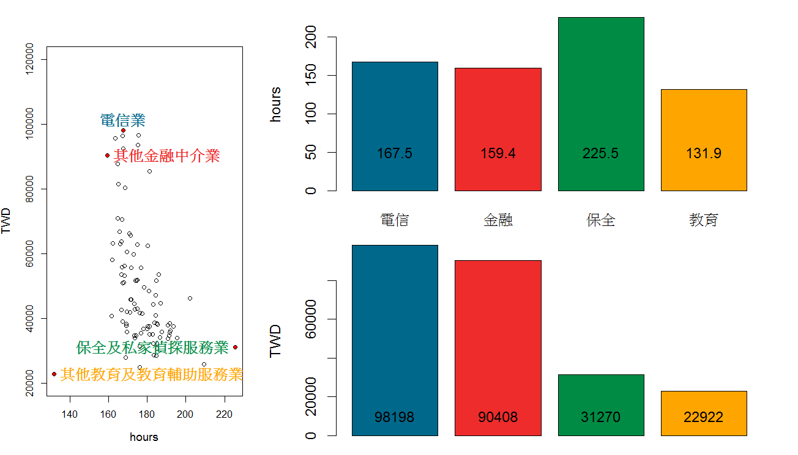</img>

---
## Exercise
    plot(TWD~hours,time_salary)
 


--- 
## Exercise
    ind=identify(time_salary,plot=FALSE)

- identify可以偵測圖上選擇的點之index
- 執行上述指令後，在圖上以滑鼠點擊選擇欲觀察的點
- 選完後，在Console按ESC鍵

---
## Exercise
    points(time_salary[ind,],pch=20,col='red')
    text(time_salary[ind,],rownames(time_salary)[ind],col='dodgerblue',font=2)

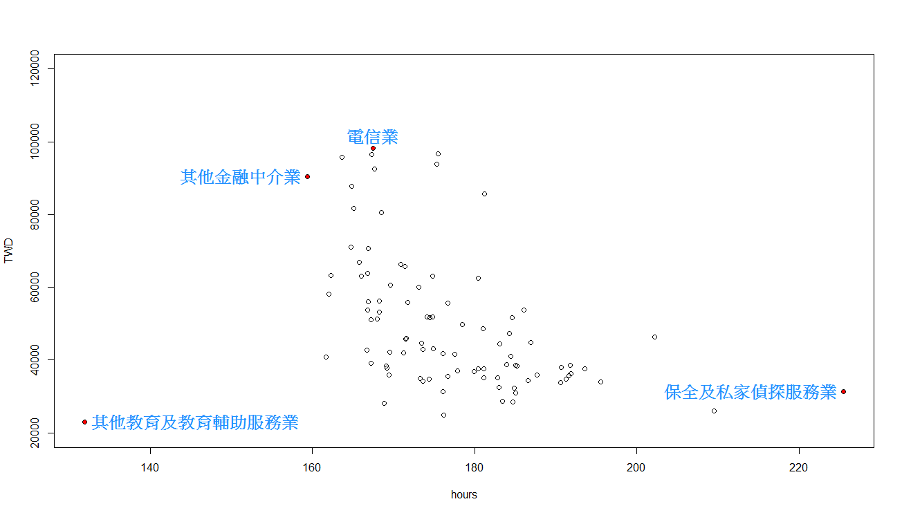</img>

---
## Exercise
# 利用layout，將Scatter plot與Bar plot結合
    layout(matrix(c(1,1,2,3), 2, 2), widths=c(3,6), heights=c(2,2))
    plot(TWD~hours,time_salary,xlim=c(100,260),ylim=c(2e4,1.2e5))
    points(time_salary[ind,],pch=20,col='red')
    text(time_salary[ind,],rownames(time_salary)[ind],pos=1:4,col='dodgerblue',font=2)
    mp1=barplot(time_salary[ind,1],ylab='hours')
    text(mp1,50,time_salary[ind,1])
    barplot(time_salary[ind,2],ylab='TWD')
    text(mp1,10000,time_salary[ind,2])


--- .segue .nobackground .dark
## Others

---
## Save image
    png(file='test.png')
    plot(iris[,3:4])
    dev.off()
- png
- pdf
- jpeg
- bmp
- tiff

---
## wordcloud


    install.packages("wordcloud")
    library("wordcloud")
    wordcloud(words=c(letters,LETTERS,0:9),freq=seq(1,1000,len=62))
    

---
## Project

# Browser market

<iframe src='http://www.netmarketshare.com/browser-market-share.aspx?qprid=1&qpcustomb=0'></iframe>

# 試著把資料呈現成...

---
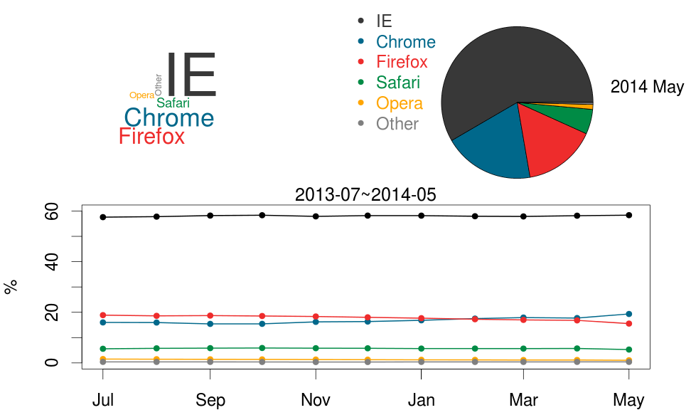 


---
## Project
# 你可能需要...
    library(XML)
    library(xts)
    html='http://www.netmarketshare.com/browser-market-share.aspx?qprid=1&qpcustomb=0'
    test_doc=htmlParse(html,encoding="big5",replaceEntities=TRUE)
    test = readHTMLTable(test_doc)
    browser_table=data.frame(Month=as.POSIXct(c(paste(2013,7:12,1,sep='-'),
    paste(2014,1:5,1,sep='-')))) #Transform to time series data
    for (i in 2:7){
      #transform to numeric data
      browser_table=cbind(browser_table,
      as.numeric(gsub('%','',as.character(test$fwReportTable1[,i])))) 
    }
    colnames(browser_table)[2:7]=colnames(test$fwReportTable1)[2:7]
    colnames(browser_table)[2]="IE"

---
## Project
# Answer
    plot_color=c("gray22", "deepskyblue4", "firebrick2", "springgreen4", "orange",'gray50')
    palette(plot_color) 
    layout(matrix(c(3,1,2,1), 2, 2), widths=c(2,2), heights=c(2,2))
    par(mar=c(4,4,0,2),cex=1.2)
    plot(browser_table[,1:2],type='o',lwd=2,ylim=c(0,60),pch=20)
    for (i in 3:7){
      lines(browser_table[,c(1,i)],type='o',col=i-1,lwd=2,pch=20)
    }
    par(mar=c(0,0,0,0.1),cex=1.2)
    pie(as.numeric(last(browser_table)[2:7]),col=1:6,labels="")
    legend('topleft',legend=colnames(browser_table)[2:7],text.col=1:6,col=1:6,pch=20,bty='n')
    par(mar=c(0,0,0,0),cex=1)
    wordcloud(colnames(browser_table)[2:7],last(browser_table)[,2:7]*10000,scale=c(6,1),
    ordered.colors = TRUE,colors =1:6)

--- .segue .nobackground .dark
## Thank you!
